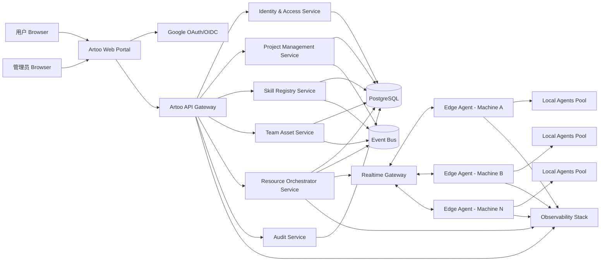
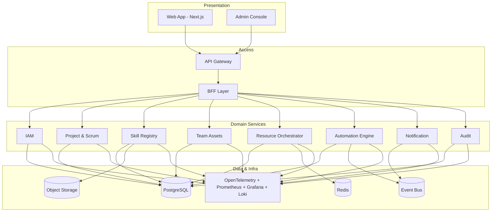
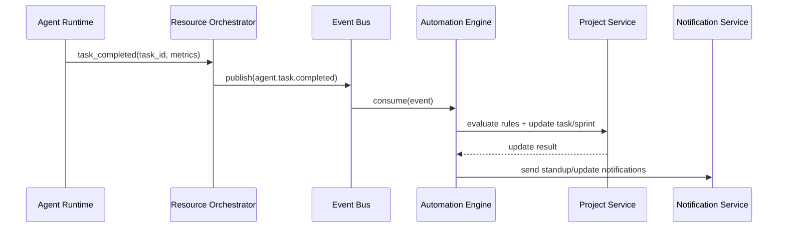
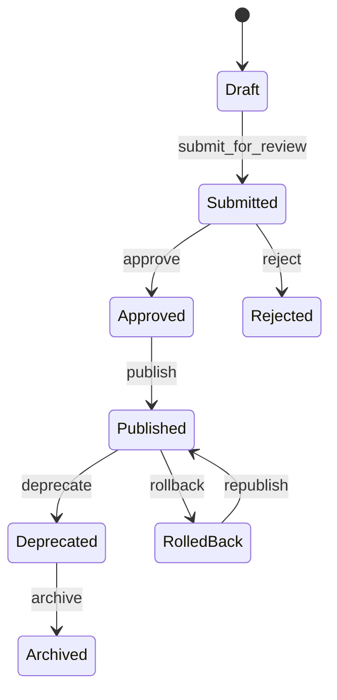
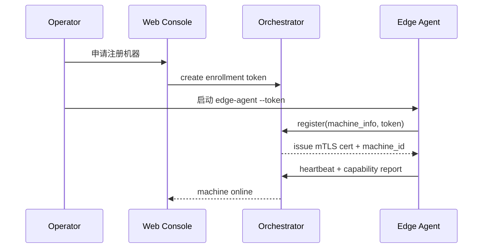
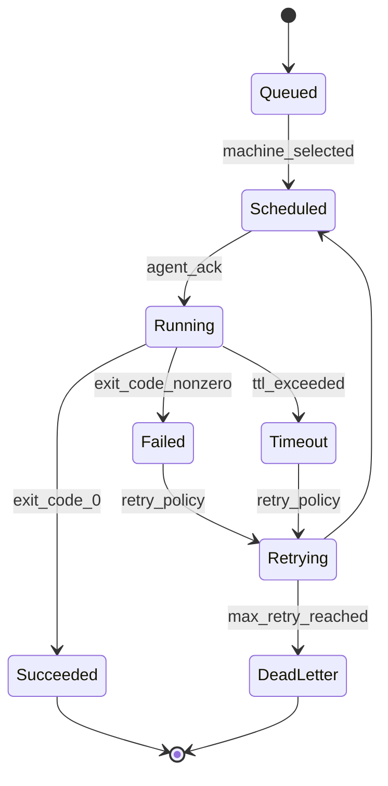
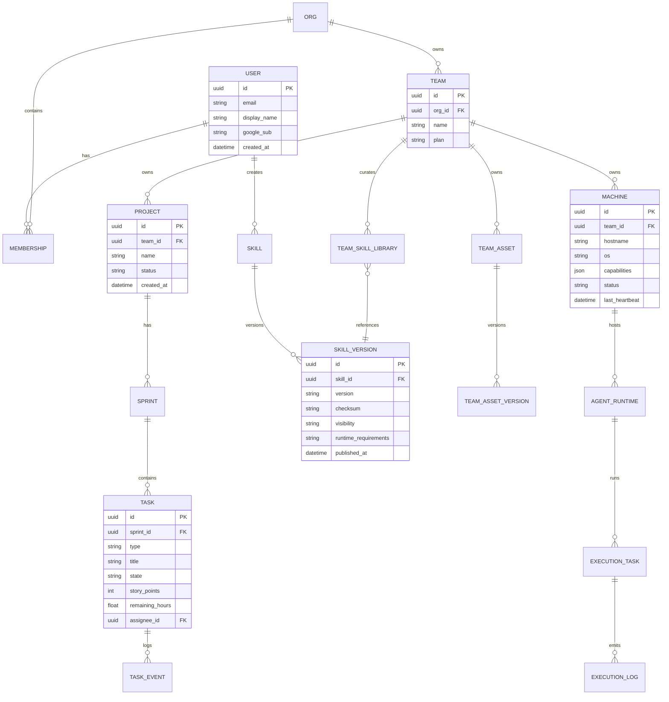
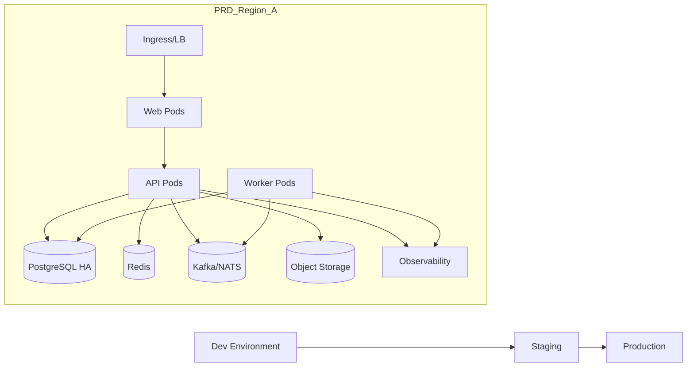

# Artoo 平台架构设计（Architecture.md）

## 1. 文档目标与范围

本文档定义 Artoo 的完整架构方案，目标是支撑以下定位：

- Artoo 是一个集中管理 Agent 的项目管理与开发平台。
- 提供统一 Web 管理入口。
- 通过 Google 登录管理用户身份与权限。
- 支持项目进度管理（参考 Scrum Dashboard），并具备自动化进度管理能力。
- 提供 Skill 资产管理（个人与团队维度）。
- 提供团队资产管理。
- 提供计算资源管理（连接多个计算机，并管理计算机中的多个 Agents）。

本文档不仅描述宏观架构，还覆盖实现细节、关键数据模型、核心 API、调度机制、可观测性、安全、测试、部署、扩展路径与实施计划。按本文档执行，可完成高质量交付。

---

## 2. 设计原则

1. 平台化优先：统一身份、权限、审计、资产模型与调度协议。
2. 先快后稳：第一阶段采用“模块化单体 + 事件总线”加速上线；后续按域拆分服务。
3. 云边协同：控制面集中，执行面分布（Edge Agent 在用户计算机上运行）。
4. 自动化可解释：进度自动化规则可追踪、可回放、可人工纠偏。
5. 安全默认开启：最小权限、零信任连接、全链路审计。
6. 可观测内建：日志、指标、追踪、事件审计从第一天纳入。

---

## 3. 产品能力总览

### 3.1 用户侧

- Google 登录
- 我的项目（Scrum 看板、Sprint、燃尽图、自动状态更新）
- 我的团队（成员、角色、资源使用）
- 我的 Skill 库（收藏、版本、复用、发布）
- 我的计算资源（机器在线状态、Agent 状态、任务执行记录）

### 3.2 管理侧

- 租户/组织管理
- 团队资产治理
- Skill 审核与分发策略
- 计算资源调度策略
- 安全与审计中心

### 3.3 系统侧

- 统一身份与权限
- 项目管理自动化引擎
- Skill Registry（Skill 仓库）
- Resource Orchestrator（计算资源编排）
- Telemetry & Audit（观测与审计）

---

## 4. 总体架构

### 4.1 系统上下文图



### 4.2 逻辑分层



---

## 5. 业务域设计与模块实现细节

## 5.1 身份与权限（IAM）

### 目标

- 统一用户身份（Google 登录）
- 多组织/多团队访问控制
- 支持资源级授权（项目、Skill、机器、Agent）

### 实现方案

- 协议：OAuth 2.0 + OIDC（Google）
- 登录流程：Authorization Code + PKCE
- 会话策略：
  - Web：HttpOnly + Secure + SameSite Cookie 存储短期 Session
  - API：JWT Access Token（短时）+ Refresh Token（轮换）
- 授权模型：RBAC + ABAC 混合
  - RBAC：Owner, Admin, PM, Developer, Viewer, AgentOperator
  - ABAC：按 team_id、project_id、asset_scope、machine_labels 做动态约束
- 关键实现：
  - 用户首次登录自动入驻个人 Workspace
  - 可邀请加入组织/团队
  - SCIM 留作企业版扩展

### 权限判定顺序

1. 校验身份（Token / Session）
2. 校验组织成员关系
3. 校验角色权限（RBAC）
4. 校验资源标签与范围（ABAC）
5. 记录授权审计

---

## 5.2 项目管理（Scrum Dashboard + 自动化）

### 核心能力

- Backlog 管理（Epic/Story/Task/Bug）
- Sprint 规划与执行
- Kanban（To Do / In Progress / Review / Done）
- Burndown/Burnup
- Velocity 与周期统计
- 自动化进度管理

### 自动化规则引擎（Automation Engine）

- 触发器：
  - 任务状态变化
  - PR 合并事件
  - CI 状态事件
  - Agent 任务完成事件
  - 时间触发（每日站会前）
- 动作：
  - 自动迁移任务状态
  - 自动更新剩余工时
  - 自动标记阻塞
  - 自动生成 Standup Summary
  - 自动提醒负责人
- 规则 DSL（建议 JSON/YAML）

规则示例：

```yaml
name: auto-move-to-review
scope: team
trigger:
  type: event
  event: agent.task.completed
conditions:
  - field: task.linked_pr_status
    op: equals
    value: open
actions:
  - type: task.transition
    from: in_progress
    to: review
  - type: notify
    channel: in_app
    template: review_pending
```

### 项目自动化流程图



---

## 5.3 Skill 资产管理（Skill Registry）

### 核心能力

- Skill 创建、版本化、标签分类
- Skill 依赖关系管理
- 私有/团队/组织可见性
- Skill 审核、发布、回滚
- Skill 引入到个人技能库
- Skill 与 Agent 运行时兼容性检查

### Skill 数据结构建议

- Skill 元数据：name、summary、owner、visibility、domain_tags
- 版本元数据：version、changelog、runtime_requirements、checksum
- 依赖：depends_on_skill_versions
- 安全：签名、扫描结果（恶意指令/泄露风险）

### Skill 生命周期



### 落地建议

- Skill 内容存 Object Storage（版本不可变）
- 元数据与索引存 PostgreSQL
- 热门查询（按标签、兼容性）进 Redis 缓存

---

## 5.4 团队资产管理（Team Asset Service）

### 资产类型

- 文档资产（规范、模板）
- 流程资产（自动化规则、审批模板）
- Skill 集合资产（团队标准技能包）
- 资源策略资产（机器池规则、预算策略）

### 功能

- 资产目录与分层空间（Org / Team / Project）
- 权限与审批流
- 版本与变更审计
- 资产引用追踪（谁在使用）

### 实现关键

- 每个资产均有 `asset_id + version + scope`
- 引用关系图用于影响分析（删除前检查）
- 强制审计日志（谁在何时改了什么）

---

## 5.5 计算资源管理（Machines + Agents）

### 目标

- 连接多台机器
- 每台机器管理多个 Agent Runtime
- 中心调度、统一监控、故障隔离

### 架构角色

- Control Plane（云端）：
  - Resource Orchestrator
  - Scheduler
  - Realtime Gateway
- Data Plane（边缘）：
  - Edge Agent（驻留在机器）
  - Local Agent Runtimes

### 机器接入流程



### 调度策略（Scheduler）

输入：

- 任务需求（CPU/GPU/RAM、网络、工具链、Skill 依赖）
- Agent 能力标签（language、toolset、model access）
- 机器状态（负载、可用性、健康分）
- 策略约束（团队配额、预算、数据驻留）

算法建议（第一版）：

- 过滤：硬约束过滤（资源/标签/权限）
- 评分：
  - $score = w_1 * capacity + w_2 * health + w_3 * affinity - w_4 * queueLatency - w_5 * cost$
- 选取：Top-N + 随机抖动（减少热点）
- 回退：失败重试到下一候选

### 健康管理

- 心跳超时判定离线
- Agent 粒度健康（process alive + task success rate）
- 自动隔离（连续失败阈值触发 cordon）
- 自动恢复（健康窗口稳定后 uncordon）

### 任务执行状态机



---

## 6. 数据模型（核心 ER）



---

## 7. API 设计（关键接口）

## 7.1 IAM

- `GET /auth/google/login`
- `GET /auth/google/callback`
- `POST /auth/refresh`
- `POST /auth/logout`
- `GET /me`

## 7.2 项目管理

- `GET /teams/{teamId}/projects`
- `POST /projects/{projectId}/sprints`
- `PATCH /tasks/{taskId}/state`
- `POST /projects/{projectId}/automation/rules`
- `GET /projects/{projectId}/dashboards/scrum`

## 7.3 Skill

- `POST /skills`
- `POST /skills/{skillId}/versions`
- `POST /skills/{skillId}/submit-review`
- `POST /skills/{skillId}/publish`
- `POST /skill-libraries/{libraryId}/import/{skillVersionId}`

## 7.4 资源调度

- `POST /machines/enroll-token`
- `POST /machines/register`
- `POST /machines/{machineId}/heartbeat`
- `POST /executions/dispatch`
- `GET /executions/{executionId}`
- `POST /executions/{executionId}/cancel`

## 7.5 审计

- `GET /audit/events?actor=&resource=&from=&to=`

### 事件总线主题建议

- `project.task.updated`
- `project.sprint.updated`
- `skill.version.published`
- `team.asset.updated`
- `agent.task.completed`
- `machine.status.changed`
- `security.authz.denied`

---

## 8. 前端架构（Web）

### 技术栈建议

- Next.js（App Router）
- TypeScript
- TanStack Query（服务端状态）
- Zustand（轻量本地状态）
- ECharts（图表）
- WebSocket/SSE（实时状态）

### 页面结构

- `/login`
- `/workspace`
- `/workspace/projects/:id/dashboard`
- `/workspace/skills`
- `/workspace/team-assets`
- `/workspace/resources/machines`
- `/workspace/resources/executions`
- `/workspace/admin/audit`

### 前端模块

- Auth Module
- Dashboard Module
- Skill Library Module
- Team Asset Module
- Resource Monitor Module
- Notification Center

### 关键交互

- Dashboard 卡片支持实时刷新（SSE）
- 看板拖拽时做乐观更新，失败自动回滚
- 资源页展示机器与 Agent 两层级拓扑

---

## 9. 非功能设计

## 9.1 性能与容量

初期目标（可按上线规模调整）：

- 并发在线用户：5,000
- 日事件吞吐：5M
- 在线机器数：10,000
- 每机 Agent 数：1-20
- 平均任务调度延迟：< 2s
- Dashboard 首屏：P95 < 1.5s

## 9.2 可用性目标（SLO）

- 控制面 API 可用性：99.9%
- 调度服务可用性：99.95%
- 心跳处理成功率：99.99%

## 9.3 安全

- 全链路 TLS，边缘接入 mTLS
- Token 最小生命周期 + 轮换
- 机密管理（Vault/KMS）
- 细粒度审计日志
- WAF + 速率限制
- 输入与 Skill 内容安全扫描

## 9.4 合规与审计

- 审计保留：180~365 天（按版本策略）
- 敏感操作双重确认（删除资产、发布全局 Skill）
- 数据分级与脱敏导出

---

## 10. 可观测性与运维

### 10.1 指标体系

- API：QPS、P95、错误率
- 调度：队列长度、调度延迟、重试率
- 机器：在线率、心跳延迟、负载
- Agent：成功率、平均执行时长
- 自动化规则：触发次数、命中率、误触发率

### 10.2 日志与追踪

- Trace ID 贯穿：Web -> API -> Scheduler -> Edge Agent
- 结构化日志（JSON）
- 错误按域分级（P0-P3）

### 10.3 告警策略

- API 错误率 > 3%（5 分钟）
- 调度延迟 P95 > 5s（10 分钟）
- 在线机器骤降 > 20%（3 分钟）

---

## 11. 发布与部署架构



### 建议

- 容器编排：Kubernetes
- CI/CD：GitHub Actions + ArgoCD（或同类 GitOps）
- 数据库：主从 + PITR
- 灰度策略：按团队/租户分批放量

---

## 12. 失败场景与恢复策略

1. Scheduler 故障：
   - 读写分离 + 主备切换
   - 未确认任务通过幂等键重放
2. Edge Agent 断连：
   - 任务进入可恢复队列
   - 机器标记为 suspect，等待心跳恢复
3. 事件总线积压：
   - 按主题限流
   - 自动扩容消费者
4. 规则误触发：
   - 规则版本化
   - 一键回滚 + 事件重演

---

## 13. 测试与质量保障

### 测试分层

- 单元测试：核心领域逻辑（权限、状态机、调度评分）
- 集成测试：服务 + DB + MQ
- 合约测试：API schema 与事件 schema
- 端到端测试：登录、看板、Skill 发布、机器调度
- 混沌测试：断网、延迟、节点失败

### 关键验收用例

- Google 登录成功并拿到资源权限
- Scrum 看板自动更新与手工回滚都可用
- Skill 从创建到发布全链路可追踪
- 多机器多 Agent 的任务调度稳定
- 审计日志可按人/时间/资源精确检索

---

## 14. 分阶段实施路线（建议 4 阶段）

## Phase 1（MVP，8~12 周）

- Google 登录 + 基础 RBAC
- 项目与 Scrum 看板
- 基础 Skill 库（创建/版本/导入）
- 机器接入与心跳
- 简单调度（过滤 + 轮询）

交付标准：

- 1 个团队可完成真实项目管理与任务分发

## Phase 2（强化，6~8 周）

- 自动化规则引擎
- 团队资产中心
- 调度评分模型 + 重试策略
- 实时状态面板

交付标准：

- 自动化处理至少 40% 的状态更新场景

## Phase 3（规模化，8~10 周）

- 多租户隔离增强
- 审计中心、告警中心
- 高可用架构与跨可用区部署
- 成本/配额治理

交付标准：

- 10,000 台机器级别压测通过（目标阈值）

## Phase 4（企业化）

- 企业 SSO/SCIM
- 更细粒度合规策略
- 多区域灾备

---

## 15. 关键技术决策（ADR 摘要）

1. 架构风格：模块化单体起步，避免早期微服务过度拆分。
2. 身份协议：优先 OIDC 标准，减少供应商锁定风险。
3. 调度通道：控制平面与执行平面解耦，保障边缘波动可控。
4. 事件驱动：项目自动化与资源状态同步采用事件总线。
5. 资产版本化：Skill 与 Team Asset 全量版本化，保证可回滚与审计。

---

## 16. 交付清单（可直接拆任务）

- 需求与领域模型
  - 用户、团队、项目、Skill、机器、Agent、任务实体定义
- 后端
  - IAM、Project、Skill、TeamAsset、ResourceOrchestrator、Audit 六大模块
  - 事件 schema 与幂等策略
- 前端
  - 登录、Dashboard、Skill、资产、资源、审计页
- 边缘侧
  - Edge Agent（注册、心跳、执行、日志上报）
- 平台能力
  - 监控、日志、追踪、告警
- 质量体系
  - 单元/集成/E2E/压测/混沌脚本
- 运维
  - IaC、CI/CD、灰度发布、回滚预案

---

## 17. 风险清单与缓解

1. 规则自动化误判风险
   - 缓解：灰度规则、回放验证、人工确认阈值
2. 边缘环境异构导致执行不稳定
   - 缓解：能力标签、兼容性矩阵、预检任务
3. 资源热点与调度倾斜
   - 缓解：随机抖动 + 负载反馈 + 热点熔断
4. Skill 安全与供应链风险
   - 缓解：签名校验、内容扫描、发布审批
5. 多租户数据边界风险
   - 缓解：租户隔离键强制注入 + 审计巡检

---

## 18. 总结

Artoo 的最佳落地路径是“统一控制面 + 分布式执行面 + 事件驱动自动化”。

该方案在 MVP 阶段即可提供真实业务价值（项目可视化管理、Skill 资产沉淀、机器与 Agent 统一调度），并在后续阶段平滑扩展到企业级规模与治理能力。通过本文档中的模块设计、数据模型、流程状态机、SLO、测试与发布策略，团队可以直接进入实施并实现高质量交付。
