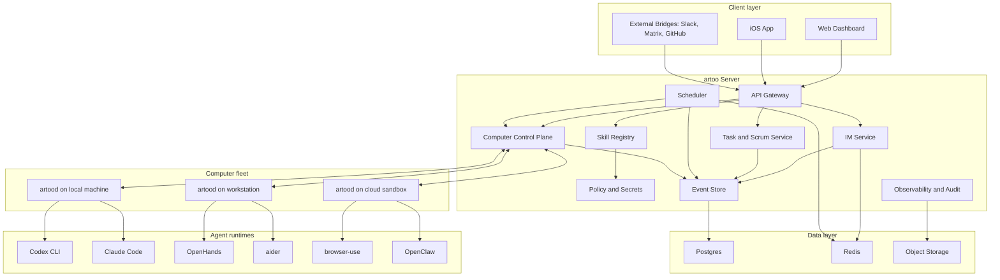
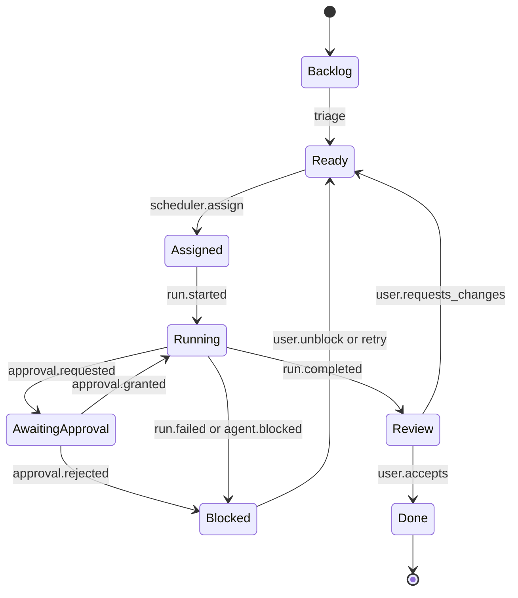
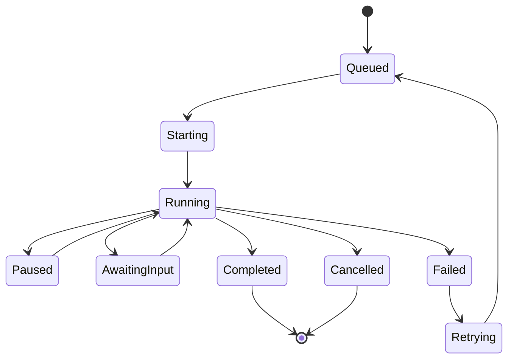
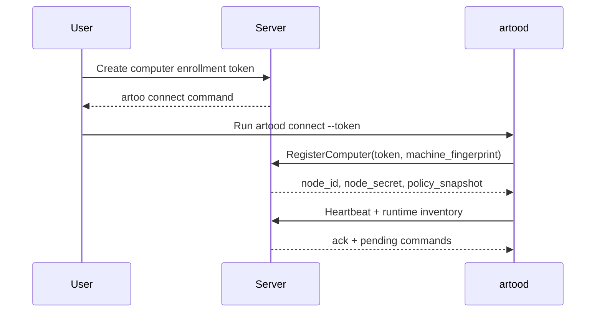
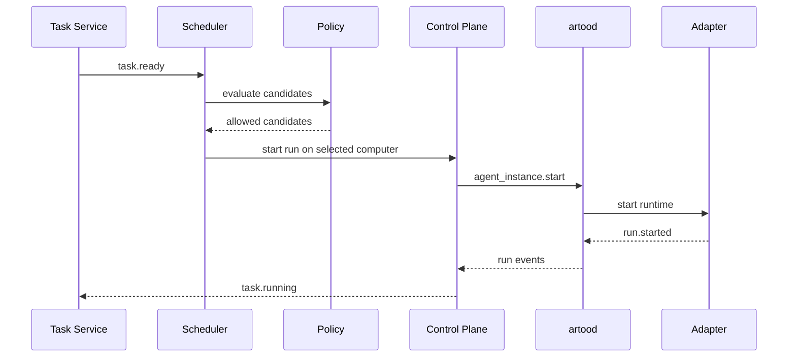
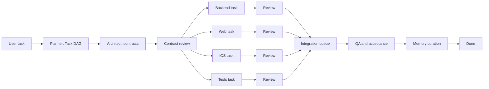

# artoo design

> 设计日期：2026-06-11  
> 输入文档：[opportunities.md](./opportunities.md)  
> 设计目标：把 artoo 从“机会判断”推进到可落地的产品和系统设计，明确架构边界、模块职责、数据模型、协议接口、客户端体验、Agent 开发方式和实施拆解。

## 1. 项目背景、开源架构比较与 artoo 定位

### 1.1 背景

AI Agent 正在从“单个聊天窗口里的助手”演进成“可以长期运行、操作电脑、读写代码、调用工具、协作完成任务的工作单元”。但真实使用中，能力越强，碎片化也越明显：

- Coding agent 分散在 CLI、IDE、Web UI、GitHub bot 中。
- Computer-use agent 可以操作浏览器或桌面，但通常只面向单台机器或单个用户。
- Multi-agent framework 可以在代码里编排多个 agent，但协作过程对团队成员不可见。
- IM 工具能让人聊天，也能接 bot，但 Agent 往往不是一等身份。
- Scrum 工具能管 backlog、sprint 和 task，却不能原生理解 agent run、approval、artifact、computer resource。
- Tool/MCP 生态能连接外部能力，但没有统一的 skill 生命周期、权限、评测和调度模型。

artoo 的起点是把这些碎片统一成一个开源控制平面：用户不必关心某个任务应该打开哪个终端、在哪台机器跑哪个 agent、如何把执行日志同步到项目管理和 IM，也不必在手机上只能被动接收通知。artoo 希望让人类和 AI Agent 在同一个任务、消息、技能和计算资源系统中协作。

### 1.2 成熟开源项目的架构比较

| 项目类型 | 代表项目 | 成熟架构/设计 | artoo 借鉴点 | artoo 不应照搬的地方 |
| --- | --- | --- | --- | --- |
| Personal computer-use assistant | OpenClaw、Clawith、Bytebot | 本地 agent 或 remote desktop agent，连接电脑环境，提供 Web/Telegram/Chat UI，执行桌面或浏览器任务 | Computer node、桌面控制、用户授权、本地优先体验 | 不能停留在单人单机助手，需要扩展到多 Computer、多 runtime、多实例和团队协作 |
| Agent gateway/data access | Hermes Agent | Agentic gateway、数据访问、tool gateway、结构化资源连接 | 把本地数据、外部工具和结构化资源纳入 skill/tool 层 | Hermes 更像能力网关，不是完整 team operating system，artoo 需要把 gateway 能力接入任务、IM、权限和调度 |
| Agent collaboration workspace | Slock | 频道、DM、状态、用户和 AI Agent 共处的协作空间概念 | Agent-native IM、Agent presence、Agent-Agent 和 User-Agent 协作体验 | 公开开源基座有限，artoo 应做成真正可自托管、可连接 Computer fleet 的开源实现 |
| Human-in-the-loop multi-agent UI | HiClaw、AgentScope 生态 | 多 Agent 可视化、人机协作界面、agent workflow 观察和干预 | 借鉴多 Agent 编排 UI、人工介入点、运行态可视化 | artoo 不能只做多 Agent UI，还必须管理多 Computer、多 runtime、多实例、IM、Scrum、Skill 和权限 |
| Coding agent | OpenHands、SWE-agent、Codex CLI、Gemini CLI、Cline、Roo Code、aider | Workspace + Agent loop + tool execution + patch/test/review + event stream | 把这些 agent 接成 runtime adapter，统一任务分配、日志、产物和审批 | 不重新造“最聪明的 coding agent”，避免和成熟工具正面重复 |
| Browser/desktop automation | browser-use、Agent-S、Cua、Open Interpreter | 浏览器或 GUI action abstraction，agent 根据观察结果执行动作 | 把 browser/desktop capability 建模为 Computer capability 和 Skill capability | 不让单个 automation engine 绑死系统架构 |
| Multi-agent framework | AutoGen、LangGraph、CrewAI、CAMEL、Agno、Mastra、VoltAgent | 角色、graph、workflow、状态机、agent runtime、tool/memory/eval | 借鉴 agent role、delegation、stateful workflow 和 observability | 不把协作隐藏在代码内部，关键决策必须进入 task room 和 event store |
| IM/collaboration | Mattermost、Rocket.Chat、Matrix、Zulip、Tinode | Room/channel、message、presence、notification、thread、bridge、app/bot framework | IM server/client、presence、notification、bridge、message event model | 不做通用 Slack 替代品，Agent 必须是一等 actor，而不是 bot 插件 |
| Scrum/project management | Plane、OpenProject、AppFlowy、Taiga、Wekan、Huly | Project、issue/task、sprint、board、workflow、assignee、comment、attachment | Scrum dashboard、task lifecycle、board UX、权限和审计 | 不做传统 project management 功能堆叠，重点是 agent work lifecycle |
| Tool/skill/workflow platform | MCP servers、Composio、Dify、n8n、Flowise、Langflow、Open WebUI | Tool registry、connector、workflow graph、LLM app、RAG、provider 管理 | 兼容 MCP，借鉴 workflow authoring、tool schema、marketplace | Tool 不是终点，artoo 需要 skill lifecycle、permission、approval、eval 和 scheduler matching |

这些项目证明了各个局部能力已经成熟，但也暴露出一个空白：没有一个开源项目把多台 Computer、多类 Agent、多实例、IM、Scrum、Skill、权限、调度和 iOS 控制统一成一个完整的 Agent 团队操作系统。

### 1.3 为什么提出 artoo

artoo 解决的是“Agent 变多以后，协作和治理跟不上”的问题。典型场景如下：

1. 用户有本机、工作站、云主机、CI runner、浏览器沙箱和 GPU 节点，但不知道哪个任务最适合跑在哪台机器。
2. 团队同时使用 Claude Code、Codex、OpenHands、aider、browser-use、OpenClaw 和自研 agent，但每个工具都有自己的入口、日志和状态。
3. 用户想在 iOS 上创建任务、补充上下文、批准高风险操作、查看进度、验收结果，但现有工具大多是桌面或终端优先。
4. Agent 之间可以协作，但协作过程通常不可见，任务拆分、handoff、review 和失败原因难以审计。
5. Skill 和 tool 的权限边界不清楚，Agent 能做什么、为什么能做、在哪个任务里做，缺少统一治理。

artoo 的想法不是替代所有 agent，而是把现有 agent 放进一个共同的操作系统中：统一身份、统一任务、统一消息、统一运行、统一权限、统一调度。

### 1.4 artoo 的核心特色

- **Open-source agent team operating system**：面向人类和 Agent 混合团队，而不是单点 agent 工具。
- **Computer fleet control plane**：统一管理多台 Computer、agent runtime、agent instance、资源和健康状态。
- **Agent-native IM**：User 和 Agent 都是一等 actor，能私聊、群聊、@mention、汇报状态、请求审批和交接任务。
- **Task-first Scrum dashboard**：每个 task 都能关联 room、run、artifact、approval、assignee、sprint 和 acceptance criteria。
- **Skill governance**：Skill 不只是 tool wrapper，而是带 capability、permission、runtime compatibility、eval、version 和 policy 的能力包。
- **Mobile control surface**：iOS 不是通知壳，而是创建、分发、审批、暂停、重试和验收 agent task 的遥控器。
- **Audit and replay**：消息、任务、运行、工具调用、审批和产物进入同一条事件事实流，方便追踪和复盘。

### 1.5 解决的核心痛点

| 痛点 | 当前常见做法 | artoo 方案 |
| --- | --- | --- |
| 任务入口分散 | Slack、GitHub Issue、CLI prompt、Web UI 各自为政 | Task + Room + Dashboard 统一入口 |
| Agent 选择依赖人工 | 用户手动决定用哪个 agent 和哪台机器 | Scheduler 根据 capability、资源、队列、权限、成本和偏好选择 |
| 日志和产物分散 | 留在终端、agent Web UI 或临时文件 | Run timeline + Artifact store + Message event |
| Agent 协作不可见 | 多 agent framework 内部对话，团队看不到 | Collaboration protocol + task room 可审计协作 |
| 权限边界薄弱 | Tool token 和本地权限直接暴露给 agent | Skill permission + policy + approval + sandbox |
| 手机端无法控制 | 只能看通知，不能推进任务 | iOS task creation、approval inbox、run status、artifact review |

### 1.6 设计原则

1. **集成优先，不重造成熟 agent**：成熟 coding agent、browser agent、MCP tool 和 workflow tool 都应以 adapter/bridge 方式接入。
2. **任务是一等对象**：消息、运行、产物、审批、技能和资源调度都围绕 task 组织。
3. **Agent 是一等 actor**：Agent 有身份、状态、权限、能力、任务、消息和审计轨迹。
4. **事件是事实来源**：IM、Dashboard、Scheduler、Audit、iOS notification 都消费统一 event store。
5. **安全默认保守**：高风险文件写入、网络操作、secret 使用、外部发布和 Git push 默认需要 policy 或 approval。
6. **MVP 必须闭环**：第一阶段只追求一个任务从创建到执行、审批、产出、验收的完整路径。
7. **开放协议和自托管**：避免把用户源码、桌面、secrets 和 agent logs 锁进封闭 SaaS。

### 1.7 非目标

- artoo 第一阶段不做通用 Slack/Discord 替代品。
- artoo 第一阶段不重新实现完整 coding agent。
- artoo 第一阶段不做复杂 workflow canvas。
- artoo 第一阶段不做企业级 portfolio/project management 全功能。
- artoo 第一阶段不追求自动 multi-agent decomposition 的最优算法。

## 2. 整体架构与产品形态

### 2.1 一句话架构

artoo = Client UX + Agent-native Collaboration + Task/Scrum + Computer Control Plane + Runtime Adapters + Skill/Policy + Event/Audit。

用户通过 Web 或 iOS 创建任务、聊天、审批和验收；Server 负责身份、任务、IM、调度、权限、事件和 API；每台 Computer 上运行 `artood`，由它发现 runtime、启动 agent instance、执行本地权限控制、回传日志和产物；Agent runtime adapter 把 Codex、Claude Code、OpenHands、aider、browser-use、OpenClaw 等接进同一套生命周期。

### 2.2 系统拓扑



### 2.3 模块划分

| 层级 | 模块 | 主要职责 |
| --- | --- | --- |
| Client | Web Dashboard | IM、Scrum board、Computer/Agent 管理、Skill 管理、Run timeline、Approval inbox |
| Client | iOS App | 快速创建任务、查看任务状态、进入 task room、审批、暂停/重试、验收 artifact |
| Client | External Bridges | Slack/Matrix/Mattermost/GitHub 等外部入口的桥接 |
| Collaboration | IM Service | Actor、Room、Message、Presence、Mention、Notification、Task room |
| Work Management | Task and Scrum Service | Project、Epic、Sprint、Task、Board、Acceptance criteria、Assignment、Artifact |
| Work Management | Task DAG Orchestrator | 任务拆解、依赖图、可并行节点识别、阻塞传播、子任务验收聚合 |
| Control Plane | Computer Registry | Computer 注册、心跳、能力发现、资源上报、健康状态 |
| Control Plane | Agent Runtime Registry | runtime 类型、adapter、版本、安装状态、兼容能力 |
| Execution | `artood` Node Agent | 本机常驻服务，负责启动 agent、回传事件、执行本地安全边界 |
| Execution | Runtime Adapter | 统一 CLI/Web/Desktop/server agent 的生命周期接口 |
| Intelligence | Scheduler | 根据 capability、资源、队列、权限、成本、历史表现分配任务 |
| Intelligence | Concurrency Controller | 文件 lease、branch/worktree 分配、并发上限、冲突预算、integration queue |
| Intelligence | Memory Service | Run/Task/Project/Code/Org 分层记忆、上下文检索、记忆治理、context pack 生成 |
| Capability | Skill Registry | skill manifest、版本、兼容性、权限、评测、安装和启停 |
| Security | Policy and Secrets | RBAC/ABAC、approval policy、secret injection、sandbox policy |
| Platform | Event Store | 所有业务事实事件的统一写入、订阅、回放 |
| Platform | Observability and Audit | Run timeline、tool trace、日志、指标、replay bundle、审计 |
| Platform | API Gateway | REST/GraphQL/WebSocket/gRPC gateway、auth、rate limit |

### 2.4 UX/UI 总体设计

Web 是完整控制台，iOS 是高频控制面，IM 是工作中的连续上下文。

Web 的主导航建议：

- **Inbox**：审批、阻塞、@mention、需要用户响应的事项。
- **Chat**：DM、project room、sprint room、task room。
- **Board**：项目、backlog、sprint、kanban。
- **Runs**：所有 agent run 的实时流、历史、失败原因和 artifact。
- **Computers**：Computer fleet、runtime、agent instance、资源和健康状态。
- **Agents**：Agent profile、capability、状态、队列、运行记录。
- **Skills**：skill registry、安装、权限、评测、启停。
- **Settings**：organization、user、policy、secrets、bridge、audit。

iOS 的底部导航建议：

- **Inbox**：approval/blocker 优先。
- **Tasks**：创建、查看、筛选、验收任务。
- **Chat**：task room 和 DM。
- **Runs**：正在运行和最近完成的 agent run。
- **Me**：通知、默认项目、快捷输入、设备设置。

设计上不要把 artoo 做成营销型首页。第一屏应该直接进入可操作的工作台：左侧项目/房间列表，中间任务或聊天，右侧 run timeline/approval/context。

### 2.5 Server 端开发思路

Server 端推荐采用 modular monolith 起步，而不是第一天拆成大量微服务。理由是核心领域对象强关联，任务、消息、审批、事件和调度需要快速迭代。模块边界用 package 和 database schema 保持清晰，后续再拆分为独立服务。

推荐技术栈：

- TypeScript/Node.js：API、WebSocket、IM、scheduler、runtime adapter SDK、MCP TypeScript SDK 生态更顺。
- Postgres：强一致业务数据和 event store。
- Redis：presence、队列、lease、短期 pub/sub、notification fanout。
- Object storage：日志包、截图、patch、报告、附件、replay bundle。
- WebSocket：Client 实时消息和 Server 到 `artood` 的双向控制通道。
- OpenTelemetry：trace、metrics、logs 统一采集。

### 2.6 Agent 和 Node 端开发思路

Node 端的 `artood` 建议优先用 Go 或 Rust 实现，原因是常驻服务需要稳定、单二进制分发、资源占用低、跨平台能力强。若早期追求速度，也可以先用 TypeScript/Python prototype，但设计上应保持语言无关的 node protocol。

Agent 不直接依赖 artoo Server 的内部实现，而是通过 runtime adapter 接入。adapter 的职责是把不同 agent 的输入、输出、生命周期和产物转换成 artoo 的标准 `RunEvent`。

Adapter 运行位置建议：

- CLI agent、desktop agent、browser agent 的 adapter 运行在 `artood` 侧。
- Server-native agent 或 SaaS agent 的 adapter 可以运行在 Server 侧。
- 所有 adapter 都必须产生相同的 event envelope，方便 IM、Dashboard 和 Audit 消费。

### 2.7 部署模式

| 模式 | 目标用户 | 形态 | 说明 |
| --- | --- | --- | --- |
| Local dev | 个人开发者 | Server + Web + `artood` 单机 | 最快体验闭环，适合开发和 demo |
| Team self-hosted | 小团队 | 一套 Server + 多台 Computer | artoo 的主目标形态 |
| Hybrid sandbox | 团队/企业 | Self-hosted Server + cloud sandbox provider | 接入 Daytona/E2B/Cua 等隔离环境 |
| Enterprise | 企业 | HA Server + SSO + audit + policy | 后续方向，不作为 MVP 前置条件 |

MVP 数据模型应包含 `organization_id`，但第一版产品可以只支持单组织单租户，避免过早引入复杂 billing、tenant isolation 和企业组织结构。

### 2.8 关键设计决策

| 问题 | 设计选择 | 原因 |
| --- | --- | --- |
| 第一版是否多租户 | 单组织单租户，schema 保留 `organization_id` | 降低实现复杂度，同时不堵死未来企业版 |
| `artood` 是否常驻 | 设计为常驻服务，开发模式允许手动启动 | 任务调度和长时间运行需要稳定心跳，开发阶段要降低门槛 |
| Adapter 运行位置 | 本地/桌面/CLI adapter 在 node 侧，SaaS/server adapter 可在 Server 侧 | 保证本地权限和环境访问留在 Computer 内部 |
| Task room 是否强制 | 强制创建，可在 UI 中弱化 | 审计、协作和上下文回放需要统一 room |
| Approval 默认策略 | 安全优先，高风险动作默认 require approval | Agent 可操作代码、电脑和外部系统，默认应保守 |
| Skill manifest 稳定性 | `v1alpha1`，从第一版开始校验和版本化 | 允许迭代，同时形成生态契约 |
| iOS 离线能力 | 只支持草稿缓存，不做完整离线 | 第一版重点是远程控制和审批，不做复杂冲突同步 |
| 首批外部工作流 | GitHub workflow 优先 | Coding agent 和开源团队最常见，闭环价值最高 |
| IM build/reuse | artoo-native minimal IM core + bridge | Agent/task/run/approval 需要原生表达 |
| 指标采集 | 第一版采集 token/cost/latency/resource 的基础字段 | 为后续 scheduler 和评测打基础 |

### 2.9 v0.1 MVP hard contract

为了把设计变成可以稳定实施的规格，v0.1 采用以下硬边界。凡是不在本节的能力，即使在后文出现，也只作为 schema 预留或 Beta 方向，不进入 v0.1 完成定义。

| Area | v0.1 必须实现 | v0.1 明确不做 |
| --- | --- | --- |
| Client | Web dashboard 完整闭环；iOS 只冻结 API 和 push/inbox contract，可用 Web 模拟移动端审批 | 原生 iOS App 全功能、离线同步 |
| Organization | 单组织单租户，保留 `organization_id` | 多租户 billing、企业组织树 |
| Computer | 一套 Server 管理多台 `artood`；开发模式允许本机启动 node | HA control plane、自动 node installer、远程桌面全功能 |
| Runtime | 一个真实 process-based coding adapter + 一个 mock adapter | 同时深度支持 Codex/Claude/OpenHands/browser-use/OpenClaw |
| Model/Effort | AgentInstance 可配置 model profile 和 effort profile；Scheduler 可按任务风险/复杂度选择实例 | 自动学习型模型路由、跨 provider 成本优化 |
| Task DAG | 手动拆 child tasks；支持 `blocks` 和 `artifact_required`；自动 ready 解锁 | 自动复杂任务拆解、DAG 优化、hedged execution |
| Memory | Task summary、Project notes、静态 ContextPack | 自动长期记忆治理、向量检索、stale memory detection |
| Concurrency | 路径级 write file lease；branch/worktree per task；手动 merge owner | 自动冲突解决、复杂代码 ownership 推断 |
| IM | task room、project room、message、system message、approval message、presence snapshot | E2EE、federation、完整 Slack 替代 |
| Approval | command/git/external action 三类风险审批 | 任意 tool 的细粒度策略语言 |
| Skill | `skill.yaml` schema validate、permission summary、capability matching | Skill marketplace、eval 平台、复杂 MCP marketplace |
| Scheduler | Rule-based single-run assignment | 成本学习、历史成功率模型、自动多 agent decomposition |
| Observability | Run timeline、event log、artifact pointer、basic audit | 完整 replay debugger、SIEM/WORM storage |

v0.1 的“100% 可实施”定义是：工程师不需要再问产品范围问题，只需要根据本节、核心 schema、API contract、node protocol、adapter contract 和验收测试实现。后续章节若与本节冲突，以本节为准。

## 3. 核心领域模型、状态机与事件基础

### 3.1 模块解决的问题

artoo 的复杂度来自多个系统共享同一组事实：谁创建了任务、任务分给了哪个 agent、agent 在哪台 Computer 上跑、用了什么 skill、是否请求过审批、产出了什么 artifact、最后是否验收。若没有统一领域模型，IM、Dashboard、Scheduler 和 Audit 会各自维护状态，系统很快失控。

本章定义所有模块共同依赖的核心对象、状态机和事件模型。

### 3.2 核心对象

| 对象 | 说明 | 关键关系 |
| --- | --- | --- |
| Organization | 自托管实例中的组织边界 | 拥有 user、project、computer、skill、policy |
| User | 人类用户 | 属于 organization，可创建 task、发消息、审批 |
| Agent | AI actor 的抽象身份 | 可加入 room、接 task、拥有 capability、产生 run |
| Computer | 可连接和调度的计算节点 | 运行 `artood`，承载 runtime 和 agent instance |
| AgentRuntime | 某类 agent 的运行时定义 | 如 codex、claude-code、openhands、aider、browser-use |
| AgentInstance | 某台 Computer 上的具体 agent 实例 | 有状态、队列、workspace、runtime config |
| ModelProfile | AgentInstance 使用的模型配置 | provider、model、context window、cost tier、capability tags |
| EffortProfile | AgentInstance 使用的推理/执行强度配置 | low/medium/high/max、预算、超时、适用任务类型 |
| Project | 任务和协作的项目空间 | 拥有 sprint、task、room、skill policy |
| Sprint | Scrum 时间盒 | 包含 task 和 board 状态 |
| Task | 可分配、可执行、可验收的工作单元 | 关联 room、run、artifact、approval |
| TaskDAG | 一组有依赖关系的任务图 | 定义 child task、依赖边、并行层、聚合验收 |
| TaskDependency | task 之间的依赖边 | 决定 ready 条件、阻塞传播和并发边界 |
| Room | IM 协作空间 | 可绑定 project、sprint、task 或 actor |
| Message | 房间中的消息或系统事件呈现 | 关联 actor、task、run、approval、artifact |
| Skill | 可治理能力包 | 绑定 capability、permission、runtime compatibility |
| Run | 一次 agent 执行过程 | 关联 task、agent instance、computer、events、artifacts |
| Artifact | 任务产物 | patch、PR、截图、报告、日志、文件、链接 |
| Approval | 人类或 policy 对某个 action 的批准结果 | 关联 task、run、skill action、message |
| Memory | 可治理的共享记忆条目 | 关联来源事件、作用域、置信度、TTL、访问策略 |
| ContextPack | 为某次 run 生成的上下文包 | 聚合 task brief、相关记忆、代码索引、依赖任务和权限 |
| FileLease | 文件或目录的并发写入租约 | 防止多个 agent 同时修改同一冲突热点 |
| IntegrationJob | 多个 artifact 的合并和验证任务 | 关联 integration queue、merge owner、CI 结果 |
| Event | 业务事实 | 由所有模块写入和订阅 |

### 3.3 Task 状态机



状态说明：

- `Backlog`：尚未准备执行，可能只有模糊想法。
- `Ready`：有足够上下文和验收标准，可进入调度。
- `Assigned`：已选择 agent/computer，但 run 尚未启动。
- `Running`：agent 正在执行。
- `AwaitingApproval`：需要用户批准高风险操作、计划或外部动作。
- `Blocked`：缺少信息、权限、资源或上游结果。
- `Review`：agent 完成执行，等待用户或 reviewer 验收。
- `Done`：验收完成。

### 3.4 Run 状态机



Run 必须记录：

- `scheduler_decision_id`
- `computer_id`
- `agent_runtime_id`
- `agent_instance_id`
- `workspace_id`
- `skill_ids`
- `started_at`、`ended_at`
- `failure_reason`
- `resource_usage`
- `cost_estimate`

### 3.5 Event envelope

所有模块产生的事实事件使用统一 envelope：

```json
{
  "id": "evt_01J0ARTOO000000000000001",
  "type": "run.event",
  "schema_version": "2026-06-11",
  "organization_id": "org_default",
  "project_id": "proj_artoo",
  "task_id": "task_approval_inbox",
  "room_id": "room_task_approval_inbox",
  "run_id": "run_approval_inbox_001",
  "actor": {
    "type": "agent",
    "id": "agent_coder_001"
  },
  "occurred_at": "2026-06-11T06:30:00Z",
  "visibility": "project",
  "correlation_id": "corr_approval_inbox_001",
  "payload": {}
}
```

关键事件类型：

| 类型 | 生产者 | 消费者 |
| --- | --- | --- |
| `task.created` | Task Service | IM、Dashboard、Scheduler |
| `task.updated` | Task Service | Dashboard、Audit |
| `task.decomposed` | Task DAG Orchestrator | Scheduler、IM、Dashboard |
| `dag.node.ready` | Task DAG Orchestrator | Scheduler、Concurrency Controller |
| `dag.node.blocked` | Task DAG Orchestrator | IM、Dashboard、Scheduler |
| `task.assigned` | Scheduler | Task、IM、Control Plane |
| `room.created` | IM Service | Dashboard、Notification |
| `message.created` | IM Service | Web、iOS、Agent adapter |
| `computer.heartbeat` | `artood` | Control Plane、Scheduler |
| `runtime.detected` | `artood` | Runtime Registry |
| `agent_instance.started` | Control Plane | Scheduler、Dashboard |
| `run.started` | Runtime Adapter | Task、IM、Observability |
| `run.output` | Runtime Adapter | Run timeline、Object storage |
| `approval.requested` | Policy/Adapter | IM、iOS、Dashboard |
| `approval.resolved` | User/Policy | Adapter、Task |
| `artifact.created` | Adapter | Task、Dashboard、Audit |
| `file_lease.acquired` | Concurrency Controller | Scheduler、Audit、Dashboard |
| `file_lease.released` | Concurrency Controller | Scheduler、Audit、Dashboard |
| `integration.queued` | Concurrency Controller | Integrator Agent、Dashboard |
| `integration.completed` | Integrator Agent/CI | Task DAG、Dashboard、Audit |
| `handoff.requested` | Agent/User | Scheduler、IM |
| `skill.invoked` | Adapter/Tool Layer | Policy、Audit |
| `memory.proposed` | Agent/User | Memory Service、Memory Curator |
| `memory.accepted` | Memory Service | Context Builder、Audit |
| `context_pack.created` | Memory Service | Runtime Adapter、Audit |

### 3.6 存储设计

Postgres 建议分 schema：

- `identity`：organization、user、agent、membership、role。
- `collab`：room、room_member、message、presence_snapshot、notification。
- `work`：project、sprint、task、assignment、run、artifact、approval。
- `fleet`：computer、runtime、agent_instance、heartbeat、resource_sample。
- `skill`：skill、skill_version、installation、capability、permission。
- `policy`：policy_rule、secret_ref、approval_rule、audit_subject。
- `event`：event_log、event_subscription_checkpoint。

事件存储策略：

- 业务表保存当前状态，`event_log` 保存事实历史。
- 写入核心业务表时，同事务写入 event。
- 大型日志、截图、文件和 replay bundle 放入 object storage，event 只保存 pointer。
- Redis 只保存可丢弃状态，例如 presence、typing、queue lease、短期 fanout。

### 3.7 v0.1 core database schema

v0.1 只需要能支撑单组织、多 Computer、一个真实 runtime、Task DAG、task room、approval、artifact、ContextPack 和 file lease。下面字段是 migration 的最小合同，后续可以加列，但不能破坏这些主键、外键和状态枚举。

#### identity

```sql
organizations(
  id text primary key,
  name text not null,
  created_at timestamptz not null
)

users(
  id text primary key,
  organization_id text not null references organizations(id),
  email text not null unique,
  display_name text not null,
  role text not null check (role in ('owner','admin','member')),
  created_at timestamptz not null
)

agents(
  id text primary key,
  organization_id text not null references organizations(id),
  display_name text not null,
  kind text not null check (kind in ('coding','reviewer','planner','integrator','qa','memory_curator','mock')),
  status text not null check (status in ('offline','idle','queued','running','awaiting_approval','blocked','failed')),
  capabilities jsonb not null default '[]',
  created_at timestamptz not null
)
```

#### work

```sql
projects(
  id text primary key,
  organization_id text not null references organizations(id),
  name text not null,
  default_workspace text,
  created_at timestamptz not null
)

tasks(
  id text primary key,
  organization_id text not null references organizations(id),
  project_id text not null references projects(id),
  parent_task_id text references tasks(id),
  room_id text,
  title text not null,
  description text not null default '',
  status text not null check (status in ('backlog','ready','assigned','running','awaiting_approval','blocked','review','done','cancelled')),
  priority text not null default 'p2',
  assignee_type text check (assignee_type in ('user','agent','agent_team')),
  assignee_id text,
  required_capabilities jsonb not null default '[]',
  preferred_model_profile_id text,
  preferred_effort text check (preferred_effort in ('low','medium','high','max')),
  acceptance_criteria jsonb not null default '[]',
  created_by_type text not null check (created_by_type in ('user','agent','system')),
  created_by_id text not null,
  created_at timestamptz not null,
  updated_at timestamptz not null
)

task_dependencies(
  id text primary key,
  organization_id text not null references organizations(id),
  from_task_id text not null references tasks(id),
  to_task_id text not null references tasks(id),
  type text not null check (type in ('blocks','artifact_required')),
  created_at timestamptz not null,
  unique(from_task_id, to_task_id, type)
)

runs(
  id text primary key,
  organization_id text not null references organizations(id),
  task_id text not null references tasks(id),
  computer_id text not null,
  agent_instance_id text not null,
  runtime_id text not null,
  scheduler_decision_id text,
  model_profile_id text references model_profiles(id),
  effort_profile_id text references effort_profiles(id),
  status text not null check (status in ('queued','starting','running','awaiting_input','paused','completed','failed','cancelled')),
  context_pack_id text,
  started_at timestamptz,
  ended_at timestamptz,
  failure_reason text,
  sequence bigint not null default 0,
  created_at timestamptz not null
)

scheduler_decisions(
  id text primary key,
  organization_id text not null references organizations(id),
  task_id text not null references tasks(id),
  selected_computer_id text not null,
  selected_agent_instance_id text not null,
  selected_model_profile_id text references model_profiles(id),
  selected_effort_profile_id text references effort_profiles(id),
  mode text not null check (mode in ('auto','manual')),
  score integer not null,
  reason text not null,
  candidates jsonb not null default '[]',
  created_at timestamptz not null
)

artifacts(
  id text primary key,
  organization_id text not null references organizations(id),
  task_id text not null references tasks(id),
  run_id text references runs(id),
  type text not null check (type in ('patch','pull_request','file','screenshot','report','log_bundle','url','test_result')),
  uri text not null,
  metadata jsonb not null default '{}',
  checksum text,
  created_at timestamptz not null
)
```

#### collab

```sql
rooms(
  id text primary key,
  organization_id text not null references organizations(id),
  project_id text references projects(id),
  task_id text references tasks(id),
  type text not null check (type in ('dm','project','sprint','task','agent_team','incident')),
  name text not null,
  created_at timestamptz not null
)

messages(
  id text primary key,
  organization_id text not null references organizations(id),
  room_id text not null references rooms(id),
  task_id text references tasks(id),
  run_id text references runs(id),
  actor_type text not null check (actor_type in ('user','agent','system','bridge')),
  actor_id text not null,
  kind text not null,
  body text not null default '',
  payload jsonb not null default '{}',
  created_at timestamptz not null
)

approvals(
  id text primary key,
  organization_id text not null references organizations(id),
  task_id text not null references tasks(id),
  run_id text references runs(id),
  requested_by_type text not null check (requested_by_type in ('agent','system')),
  requested_by_id text not null,
  action text not null,
  risk text not null check (risk in ('low','medium','high')),
  summary text not null,
  payload_ref text,
  status text not null check (status in ('pending','approved','rejected','needs_more_info','expired')),
  resolved_by text,
  resolved_at timestamptz,
  expires_at timestamptz,
  created_at timestamptz not null
)
```

#### fleet and execution

```sql
computers(
  id text primary key,
  organization_id text not null references organizations(id),
  display_name text not null,
  hostname text not null,
  os text not null,
  arch text not null,
  status text not null check (status in ('enrolling','online','offline','disabled')),
  last_heartbeat_at timestamptz,
  resources jsonb not null default '{}',
  capabilities jsonb not null default '[]',
  created_at timestamptz not null
)

agent_runtimes(
  id text primary key,
  organization_id text not null references organizations(id),
  computer_id text not null references computers(id),
  runtime text not null,
  version text,
  status text not null check (status in ('detected','available','missing','disabled')),
  metadata jsonb not null default '{}',
  unique(computer_id, runtime)
)

model_profiles(
  id text primary key,
  organization_id text not null references organizations(id),
  name text not null,
  provider text not null,
  model text not null,
  context_window integer,
  cost_tier text not null check (cost_tier in ('low','medium','high','premium')),
  latency_tier text not null check (latency_tier in ('fast','normal','slow')),
  capability_tags jsonb not null default '[]',
  config jsonb not null default '{}',
  enabled boolean not null default true,
  created_at timestamptz not null,
  unique(organization_id, name)
)

effort_profiles(
  id text primary key,
  organization_id text not null references organizations(id),
  name text not null,
  effort text not null check (effort in ('low','medium','high','max')),
  max_runtime_minutes integer not null,
  max_cost_usd numeric(10,2),
  max_tool_calls integer,
  retry_budget integer not null default 0,
  description text not null default '',
  config jsonb not null default '{}',
  enabled boolean not null default true,
  created_at timestamptz not null,
  unique(organization_id, name)
)

agent_instances(
  id text primary key,
  organization_id text not null references organizations(id),
  computer_id text not null references computers(id),
  agent_id text not null references agents(id),
  runtime text not null,
  model_profile_id text references model_profiles(id),
  effort_profile_id text references effort_profiles(id),
  status text not null check (status in ('idle','queued','running','stopping','failed','disabled')),
  workspace_root text,
  config jsonb not null default '{}',
  created_at timestamptz not null
)
```

#### memory and concurrency

```sql
memories(
  id text primary key,
  organization_id text not null references organizations(id),
  project_id text references projects(id),
  scope_type text not null check (scope_type in ('run','task','project','code','org')),
  scope_id text,
  kind text not null,
  title text not null,
  content text not null,
  source_event_id text,
  confidence text not null check (confidence in ('low','medium','high')),
  status text not null check (status in ('proposed','active','rejected','deprecated')),
  tags jsonb not null default '[]',
  created_at timestamptz not null
)

context_packs(
  id text primary key,
  organization_id text not null references organizations(id),
  task_id text not null references tasks(id),
  run_id text,
  payload jsonb not null,
  source_memory_ids jsonb not null default '[]',
  created_at timestamptz not null
)

file_leases(
  id text primary key,
  organization_id text not null references organizations(id),
  project_id text not null references projects(id),
  task_id text not null references tasks(id),
  run_id text references runs(id),
  holder_type text not null check (holder_type in ('agent','user')),
  holder_id text not null,
  path_globs jsonb not null,
  mode text not null check (mode in ('read','write')),
  status text not null check (status in ('active','released','expired')),
  expires_at timestamptz not null,
  created_at timestamptz not null
)

integration_jobs(
  id text primary key,
  organization_id text not null references organizations(id),
  root_task_id text not null references tasks(id),
  status text not null check (status in ('queued','running','completed','failed','blocked')),
  artifact_ids jsonb not null default '[]',
  merge_owner_type text check (merge_owner_type in ('user','agent')),
  merge_owner_id text,
  result_artifact_id text,
  created_at timestamptz not null
)
```

#### event

```sql
event_log(
  id text primary key,
  organization_id text not null references organizations(id),
  type text not null,
  schema_version text not null,
  actor_type text not null,
  actor_id text not null,
  task_id text,
  room_id text,
  run_id text,
  correlation_id text not null,
  idempotency_key text,
  sequence bigint,
  payload jsonb not null default '{}',
  occurred_at timestamptz not null
)
```

v0.1 必须建立的索引：

- `tasks(project_id, status, updated_at)`
- `tasks(parent_task_id)`
- `task_dependencies(to_task_id)`
- `runs(task_id, status, created_at)`
- `messages(room_id, created_at)`
- `approvals(status, expires_at)`
- `computers(status, last_heartbeat_at)`
- `model_profiles(organization_id, enabled, cost_tier)`
- `effort_profiles(organization_id, enabled, effort)`
- `agent_instances(status, computer_id)`
- `agent_instances(model_profile_id, effort_profile_id, status)`
- `event_log(correlation_id, occurred_at)`
- `event_log(task_id, occurred_at)`
- `file_leases(project_id, status, expires_at)`

## 4. Control Plane 与 Computer Node 设计

### 4.1 模块解决的问题

用户真正拥有的是一组异构 Computer，而不是一个抽象的云集群。这些 Computer 可能是本机、远程工作站、Windows 桌面、macOS 笔记本、Linux server、云 sandbox 或 CI runner。artoo 需要知道每台机器能做什么、当前是否可用、上面有哪些 agent runtime、资源是否足够、权限边界是什么。

Control Plane 负责全局视角，`artood` 负责本地执行。

### 4.2 Control Plane 职责

- Computer 注册、认证、心跳和状态管理。
- Runtime 发现、版本上报、安装状态和能力索引。
- Agent instance 生命周期：创建、启动、暂停、恢复、停止、销毁。
- Workspace 管理：任务目录、repo checkout、artifact path、隔离策略。
- Node command dispatch：把 Server 指令可靠下发到对应 Computer。
- Event ingestion：接收 node 和 adapter 事件，写入 event store。
- Health and capacity：为 Scheduler 提供可用性、队列深度、资源余量。

### 4.3 `artood` 职责

`artood` 是运行在每台 Computer 上的常驻节点服务。

子模块：

- **Node Auth**：保存 node token，完成 mTLS 或 signed WebSocket 认证。
- **Heartbeat Reporter**：上报 OS、CPU、GPU、RAM、disk、network、battery、load、active workspace。
- **Runtime Detector**：发现 Codex、Claude Code、OpenHands、aider、browser-use、OpenClaw 等 runtime。
- **Instance Supervisor**：启动/停止/监控 agent process 或 container。
- **Workspace Manager**：准备工作目录、repo、临时文件、artifact 目录。
- **Permission Guard**：执行本地 filesystem/network/command/secrets policy。
- **Event Streamer**：把 stdout、stderr、structured events、screenshots、tool events 回传。
- **Artifact Collector**：收集 patch、PR link、文件、截图、日志包。
- **Offline Queue**：网络中断时缓存可重放事件和最终状态。

### 4.4 Node 注册流程



注册时应采集：

- Hostname、OS、architecture。
- CPU/GPU/RAM/disk。
- Network reachability。
- Installed runtimes。
- Default workspace roots。
- Sandbox support。
- Desktop/browser access support。
- Secret injection support。

### 4.5 Node protocol

MVP 建议使用 WebSocket：

- 更容易穿透 NAT 和本地网络。
- 同一连接承载 command、event、heartbeat。
- 与 Web/iOS 实时模型一致。

后续可以为高吞吐日志、artifact upload 或企业部署增加 gRPC stream。

Command envelope：

```json
{
  "id": "cmd_start_run_001",
  "type": "agent_instance.start",
  "target_node_id": "computer_workstation_001",
  "issued_at": "2026-06-11T06:40:00Z",
  "deadline_at": "2026-06-11T06:41:00Z",
  "payload": {
    "runtime": "codex",
    "task_id": "task_approval_inbox",
    "workspace": {
      "type": "git",
      "repo": "https://github.com/org/repo",
      "branch": "artoo/task-123"
    },
    "policy_snapshot_id": "polsnap_approval_inbox_001"
  }
}
```

### 4.6 v0.1 node protocol contract

v0.1 的 `artood` 协议只实现下面这些消息。所有消息都走同一个 WebSocket 连接，所有 command 都必须 ack，所有 event 都必须带 `sequence`。

#### Node -> Server

```json
{
  "kind": "node.hello",
  "node_id": "computer_123",
  "protocol_version": "2026-06-11",
  "artood_version": "0.1.0",
  "machine": {
    "hostname": "workstation",
    "os": "windows",
    "arch": "x64"
  }
}
```

```json
{
  "kind": "node.heartbeat",
  "node_id": "computer_123",
  "sequence": 42,
  "resources": {
    "cpu_load": 0.31,
    "memory_used_pct": 62,
    "disk_free_gb": 180
  },
  "runtimes": [
    {"runtime": "codex", "status": "available", "version": "unknown"},
    {"runtime": "mock", "status": "available", "version": "0.1.0"}
  ],
  "running_instances": []
}
```

```json
{
  "kind": "run.event",
  "node_id": "computer_123",
  "run_id": "run_123",
  "sequence": 7,
  "event": {
    "type": "run.output",
    "payload": {
      "stream": "stdout",
      "text": "tests passed"
    }
  }
}
```

```json
{
  "kind": "command.ack",
  "node_id": "computer_123",
  "command_id": "cmd_123",
  "status": "accepted",
  "message": null
}
```

#### Server -> Node

```json
{
  "kind": "command",
  "id": "cmd_start_run_123",
  "idempotency_key": "run_123:start",
  "type": "run.start",
  "deadline_at": "2026-06-11T08:00:00Z",
  "payload": {
    "run_id": "run_123",
    "task_id": "task_123",
    "agent_instance_id": "agent_instance_123",
    "runtime": "mock",
    "workspace": {
      "root": "C:/workspace/artoo",
      "branch": "artoo/task-123"
    },
    "context_pack": {
      "id": "ctx_123",
      "uri": "inline",
      "payload": {}
    },
    "policy_snapshot": {
      "filesystem_write_scope": ["C:/workspace/artoo"],
      "requires_approval": ["git.push", "external.post"]
    }
  }
}
```

```json
{
  "kind": "command",
  "id": "cmd_stop_run_123",
  "idempotency_key": "run_123:stop",
  "type": "run.stop",
  "payload": {
    "run_id": "run_123",
    "reason": "user_cancelled"
  }
}
```

```json
{
  "kind": "command",
  "id": "cmd_collect_artifacts_123",
  "idempotency_key": "run_123:collect_artifacts",
  "type": "artifact.collect",
  "payload": {
    "run_id": "run_123",
    "paths": ["artifacts/**", "*.patch", "test-results/**"]
  }
}
```

#### Error contract

Node command errors must use one of these codes:

- `runtime_missing`
- `workspace_missing`
- `permission_denied`
- `process_start_failed`
- `process_exited`
- `artifact_not_found`
- `timeout`
- `internal_error`

Server 处理规则：

- `runtime_missing`、`workspace_missing`：task 回到 `Ready`，Scheduler 尝试其他 Computer。
- `permission_denied`：task 进入 `Blocked`，并创建 system message。
- `process_start_failed`、`process_exited`：run `failed`，允许一次 retry。
- `artifact_not_found`：run 可完成但 artifact 标记 missing。
- `timeout`：run `failed`，释放 file lease。

### 4.7 安全边界

第一版必须具备：

- Node token 可吊销。
- Computer 可被 disable，disable 后不再接新任务。
- Workspace root allowlist。
- Command allowlist/denylist。
- Network domain allowlist。
- Secret 按 run 注入，run 结束后清理。
- 高风险动作必须触发 approval。
- `artood` 本地日志不能泄露 secret。

高风险动作包括：

- 写入 workspace 外文件。
- 执行 shell command。
- 访问生产 secret。
- 对外发送消息、评论、邮件。
- Git push、PR merge、release、deploy。
- 桌面点击涉及支付、删除、发布或账号安全。

### 4.8 MVP 边界

MVP 只需要支持：

- 单 Server 管理多 `artood`。
- `artood` 手动安装和启动，后续再做系统服务安装器。
- Linux/macOS 优先，Windows 作为紧随其后的目标。
- Runtime detector 先支持 Codex/Claude/aider/browser-use 中的 1-2 个。
- Heartbeat、start、stop、stream event、collect artifact。

## 5. Runtime Adapter 与 Agent Instance 设计

### 5.1 模块解决的问题

每个 Agent 工具的输入输出都不同：有的是 CLI，有的是 Web server，有的是 IDE extension，有的是 Python library，有的是浏览器自动化框架。artoo 需要一层 adapter，把差异封装起来，对上提供统一生命周期和事件协议。

### 5.2 Adapter contract

```ts
export interface RuntimeAdapter {
  runtimeId: string;

  detect(context: DetectContext): Promise<DetectResult>;
  installStatus(context: NodeContext): Promise<InstallStatus>;
  start(config: AgentInstanceConfig): Promise<AgentInstanceHandle>;
  send(handle: AgentInstanceHandle, input: AgentInput): Promise<void>;
  pause(handle: AgentInstanceHandle): Promise<void>;
  resume(handle: AgentInstanceHandle): Promise<void>;
  stop(handle: AgentInstanceHandle, reason: StopReason): Promise<void>;
  streamEvents(handle: AgentInstanceHandle): AsyncIterable<RunEvent>;
  collectArtifacts(handle: AgentInstanceHandle): Promise<ArtifactDescriptor[]>;
}
```

MVP 中可以先做 process-based adapter：

- 启动进程。
- 写入 stdin 或 prompt file。
- 读取 stdout/stderr。
- 从约定目录收集 artifact。
- 用正则和 JSON line 混合解析事件。

成熟后扩展为 native adapter：

- 对接 agent 自身 API。
- 读取结构化 event stream。
- 支持暂停、恢复、审批回调。
- 支持细粒度 tool call trace。

### 5.3 AgentInstance 配置

```yaml
id: agent_instance_123
runtime: codex
computer_id: computer_abc
agent_id: agent_coding_01
display_name: Codex on workstation
workspace_root: C:/workspace
model:
  profile_id: model_gpt5_codex_high
  provider: openai
  name: gpt-5-codex
  context_window: 200000
  cost_tier: premium
effort:
  profile_id: effort_high_coding
  level: high
  max_runtime_minutes: 120
  max_tool_calls: 200
  max_cost_usd: 20
limits:
  max_parallel_runs: 2
  max_runtime_minutes: 120
  max_cost_usd: 20
permissions:
  profile: project-default
skills:
  enabled:
    - git.patch
    - test.run
    - github.pr
status: idle
```

### 5.4 ModelProfile 与 EffortProfile

不同 Agent 应该可以使用不同模型和不同 effort，这样 artoo 能把简单任务交给便宜、快速的 Agent，把复杂架构、关键 review、高风险修改交给更强模型和更高 effort 的 Agent。

`ModelProfile` 描述“用哪个模型”：

```yaml
id: model_fast_coder
name: Fast Coder
provider: openai
model: gpt-5-mini-codex
context_window: 64000
cost_tier: low
latency_tier: fast
capability_tags:
  - code.modify
  - small_task
config:
  temperature: 0.2
```

`EffortProfile` 描述“花多少推理和执行预算”：

```yaml
id: effort_high_review
name: High Effort Review
effort: high
max_runtime_minutes: 90
max_cost_usd: 15
max_tool_calls: 150
retry_budget: 1
description: Used for security-sensitive or architecture-sensitive reviews.
config:
  reasoning_effort: high
  require_plan_before_changes: true
```

建议内置 profiles：

| Profile | 用途 | Model tier | Effort |
| --- | --- | --- | --- |
| `fast_fix` | 小 bug、小文案、小配置 | low/fast | low |
| `standard_coding` | 普通功能开发 | medium | medium |
| `deep_architect` | 架构、接口、数据模型 | premium | high |
| `strict_reviewer` | 安全、权限、核心代码 review | premium | high/max |
| `cheap_research` | 低风险资料整理 | low/medium | low |
| `qa_runner` | 测试、截图、验收 | medium/fast | medium |

AgentInstance 绑定默认 model/effort，但 task 可以声明偏好：

- `preferred_model_profile_id`：用户或模板指定模型偏好。
- `preferred_effort`：用户指定 low/medium/high/max。
- `risk` 或 `priority`：Scheduler 可提升 effort。
- `required_capabilities`：过滤不支持对应能力的 model profile。

优先级规则：

1. 用户显式指定 model/effort 时优先。
2. Task template 指定时次之。
3. Scheduler 根据任务类型、风险、复杂度、成本预算自动选择。
4. Project policy 可以限制最高 cost tier 或最低 required effort。

v0.1 不做自动学习型模型路由，只做规则选择和手动 override。

### 5.5 Run input 规范

Agent 接收的任务输入应包含：

- 任务标题和描述。
- 目标项目和 workspace。
- 验收标准。
- 可用 skill。
- 权限边界。
- 需要遵循的 coding/design instructions。
- 相关 room 和历史上下文摘要。
- artifact 输出要求。
- 审批策略。

示例：

```json
{
  "task": {
    "id": "task_123",
    "title": "Implement approval inbox",
    "description": "Add approval inbox to the Web dashboard.",
    "acceptance_criteria": [
      "User can see pending approvals",
      "User can approve or reject from inbox",
      "Approval result is reflected in task room"
    ]
  },
  "context": {
    "project_id": "proj_artoo",
    "room_id": "room_task_123",
    "workspace": "C:/workspace/artoo"
  },
  "model": {
    "profile_id": "model_fast_coder",
    "provider": "openai",
    "model": "gpt-5-mini-codex",
    "cost_tier": "low"
  },
  "effort": {
    "profile_id": "effort_medium_coding",
    "level": "medium",
    "max_runtime_minutes": 60,
    "max_tool_calls": 100
  },
  "policy": {
    "requires_approval": ["git.push", "external.post"],
    "filesystem_write_scope": ["workspace"]
  }
}
```

### 5.6 RunEvent 规范

Runtime adapter 产出的事件分为几类：

- `run.lifecycle`：started、paused、resumed、completed、failed、cancelled。
- `run.output`：stdout、stderr、assistant message、structured result。
- `tool.call`：工具调用开始、参数摘要、风险等级。
- `tool.result`：工具结果、失败原因、artifact pointer。
- `approval.requested`：需要人类批准。
- `artifact.created`：产物生成。
- `agent.question`：agent 需要上下文。
- `agent.proposal`：agent 提交计划。

每个事件都要能映射到 IM 和 run timeline。不是所有事件都要显示成聊天消息，但关键事件必须能在 task room 中可读。

### 5.7 首批 adapter 策略

| Runtime | 优先级 | 集成方式 | MVP 目标 |
| --- | --- | --- | --- |
| Codex CLI | P0 | Process adapter | coding task 闭环 |
| Claude Code | P0 | Process adapter | 多 provider coding runtime |
| aider | P0 | Process adapter | 轻量 Git patch workflow |
| browser-use | P1 | Python/library adapter | 浏览器任务和网页调研 |
| OpenHands | P1 | API/server adapter | 完整 software agent platform |
| OpenClaw | P1 | Local computer-use adapter | 本地 assistant 和 desktop control |

### 5.8 Agent 开发原则

- Agent 不直接修改 artoo 数据库，只通过 protocol/API 交互。
- Agent 的计划、阻塞、审批和产物必须事件化。
- Agent 之间的 delegation 必须留下 handoff event。
- Agent 需要能够接收 user feedback，并把 feedback 纳入当前 run。
- Agent 不能绕过 policy guard 调用本地高风险能力。

### 5.9 v0.1 adapter implementation contract

v0.1 不要求所有 runtime 原生支持完整生命周期。Adapter 必须实现统一外观，但可以按能力降级。

| Capability | v0.1 要求 | 不支持时的降级 |
| --- | --- | --- |
| `detect` | 必须实现 | 返回 `missing` 并提供 install hint |
| `start` | 必须实现 | 失败时返回 `process_start_failed` |
| `send` | 必须支持初始 task input | 不要求 run 中途多轮输入；需要输入时进入 `awaiting_input` |
| `streamEvents` | 必须至少支持 stdout/stderr line stream | 无结构化事件时包装为 `run.output` |
| `pause` | 可选 | 不支持时映射为 `stop` 或返回 `unsupported` |
| `resume` | 可选 | 不支持时创建新 run retry |
| `stop` | 必须实现 | 先 graceful stop，再 kill process |
| `collectArtifacts` | 必须实现 | 没有 artifact 时返回空数组并写入 `artifact_missing` warning |

v0.1 首个真实 adapter 推荐选择 `mock` 之外的一个 process-based coding runtime。选择标准：

- 可以从命令行启动。
- 可以指定 workspace。
- 可以通过 prompt file 或 stdin 注入任务。
- stdout/stderr 可被捕获。
- 产物可以通过 workspace diff、patch 文件或报告文件收集。

Process adapter 的最小运行模型：

```text
prepare workspace
write context_pack.md
start process with command template
stream stdout/stderr as run.output
watch process exit
collect git diff and artifacts
emit run.completed or run.failed
```

Command template 示例：

```yaml
runtime: mock-coder
command:
  - artoo-mock-agent
  - --context
  - "{{context_pack_path}}"
  - --workspace
  - "{{workspace_root}}"
artifacts:
  - "*.patch"
  - "artifacts/**"
success_exit_codes:
  - 0
```

真实 runtime 的深度能力，例如 tool-call trace、native approval callback、多轮 input、browser screenshot stream，全部进入 v0.2。

## 6. Scheduler 与资源分配设计

### 6.1 模块解决的问题

当任务进入 `Ready` 状态时，用户不应该每次都手动判断“用哪个 agent、跑在哪台机器、是否需要浏览器、是否需要 GPU、有没有权限”。Scheduler 的目标是把任务分配给最合适的 agent instance，并在失败、阻塞或资源变化时做可解释的调整。

### 6.2 Scheduler 输入

- Task capability requirements。
- Acceptance criteria。
- Project preferred computers。
- Available skills。
- Agent runtime compatibility。
- Model profile compatibility。
- Effort profile and budget。
- Computer health and resource。
- Agent instance queue depth。
- User priority and deadline。
- Required secrets and permission。
- Historical success rate。
- Estimated cost and latency。
- Data locality，例如 repo 是否已经在某台机器上。

### 6.3 Capability taxonomy

建议第一版定义轻量 capability：

```yaml
capabilities:
  code.read
  code.modify
  code.review
  test.run
  git.patch
  github.pr
  browser.navigate
  browser.extract
  desktop.operate
  doc.write
  research.web
  shell.run
```

Skill、Runtime、Agent、Computer 都可以声明 capability。Scheduler 根据 task 的 required/preferred capability 做匹配。

### 6.4 Scoring 规则

MVP 使用 rule-based scoring：

```text
score =
  capability_match * 100
  + runtime_available * 40
  + computer_healthy * 30
  + data_locality * 20
  + user_preference * 20
  + model_fit * 20
  + effort_fit * 15
  + idle_bonus * 15
  - queue_depth * 10
  - permission_risk * 20
  - estimated_cost * 5
```

硬性过滤：

- 缺 required capability。
- Computer offline。
- Runtime 不可用。
- Policy 不允许。
- 缺 required secret。
- ModelProfile 不满足 required capability 或 project policy。
- EffortProfile 超出 task/project cost budget。
- 资源低于最低要求。

### 6.5 Model/Effort routing

Scheduler 需要同时选择 `AgentInstance + Computer + ModelProfile + EffortProfile`。在 v0.1 中，Model/Effort 已经绑定在 AgentInstance 上，Scheduler 只需要在候选 AgentInstance 中选择；v0.2 可以允许同一个 AgentInstance 动态切换 model/effort。

任务复杂度建议：

| Task signal | 推荐 model/effort |
| --- | --- |
| 文案、简单配置、低风险小改动 | low-cost model + low effort |
| 普通功能开发、常规 bugfix | medium model + medium effort |
| 架构设计、数据模型、跨模块接口 | premium model + high effort |
| 权限、安全、支付、发布、生产操作 | premium model + high/max effort + approval |
| 大规模 refactor 或高冲突任务 | premium model + high effort + reviewer/integrator |
| 测试、截图、格式化、重复执行 | fast model + medium effort |

路由规则：

```text
if user_specified_model_or_effort:
  filter candidates by explicit preference
else:
  infer complexity from task type, priority, risk, dependencies, file scope
  select lowest-cost profile that satisfies required capability and minimum effort

if task.risk == high:
  minimum_effort = high
  require_reviewer = true

if task.priority == p0 and deadline is near:
  prefer latency_tier = fast unless risk is high
```

Model/Effort 的选择必须写入 `scheduler_decision` 和 `run`，这样后续能分析成本、速度和成功率。

### 6.6 调度流程



### 6.7 失败和重试

失败分类：

- `runtime_missing`
- `computer_offline`
- `permission_denied`
- `approval_rejected`
- `agent_failed`
- `timeout`
- `artifact_missing`
- `acceptance_failed`

重试策略：

- 同 runtime 同 Computer 重试 1 次。
- 若失败原因是资源或 runtime，换 Computer。
- 若失败原因是 agent failed，换 runtime 或请求 human review。
- 若失败原因是 permission/approval，进入 `Blocked`，不自动绕过。
- 每次重试都创建新的 Run，并关联同一个 Task。

### 6.8 多 Computer Agent 协作的核心模型

多 Computer 协作的目标不是简单地“同时启动更多 Agent”，而是把一个大目标拆成可并行、可验证、可合并、可审计的工作单元。artoo 应采用 **Task DAG + Agent Team + Shared Memory + Integration Queue** 的组合。

核心原则：

- **DAG 驱动并发**：只有依赖满足的 task 才进入 `Ready`，Scheduler 只调度 ready nodes。
- **Contract-first**：先定义接口、数据模型、文件边界和验收标准，再并行实现。
- **Artifact-based collaboration**：Agent 之间通过 artifact、contract、review result 和 handoff 协作，而不是只靠自由聊天。
- **Memory is curated**：长期共享记忆必须经过提议、筛选、结构化和作用域控制。
- **Integration is explicit**：并行产物进入 integration queue，由 Integrator Agent 或人类负责合并和回归。

### 6.9 Task DAG 设计

Task DAG 是任务有向无环图。它描述任务之间的依赖关系，告诉系统哪些任务可以并发执行，哪些任务必须等待前置任务完成。

示例：

```text
T0: Define API contract
  ├── T1: Implement backend endpoint
  ├── T2: Implement Web approval inbox
  ├── T3: Implement iOS approval inbox
  └── T4: Add policy tests
        ↓
T5: Integrate frontend/backend/iOS contracts
        ↓
T6: Run end-to-end acceptance
```

在这个 DAG 中，`T1`、`T2`、`T3`、`T4` 可以并发，但它们都依赖 `T0`。`T5` 必须等待并行任务完成，`T6` 又依赖 `T5`。

Task DAG 数据结构建议：

```yaml
id: dag_approval_inbox
root_task_id: task_100
strategy: contract_first_parallel
nodes:
  - task_id: task_api_contract
    role: architect
    outputs:
      - api_contract
      - data_model
  - task_id: task_backend
    role: implementer
    depends_on:
      - task_api_contract
    required_capabilities:
      - code.modify
      - test.run
    file_scope:
      - server/approvals/**
  - task_id: task_web
    role: implementer
    depends_on:
      - task_api_contract
    file_scope:
      - web/src/approvals/**
  - task_id: task_integration
    role: integrator
    depends_on:
      - task_backend
      - task_web
edges:
  - from: task_api_contract
    to: task_backend
    type: blocks
  - from: task_backend
    to: task_integration
    type: artifact_required
```

Task DAG node 状态：

- `planned`
- `ready`
- `leased`
- `running`
- `awaiting_approval`
- `review`
- `done`
- `blocked`
- `cancelled`

依赖边类型：

| Edge type | 含义 |
| --- | --- |
| `blocks` | 前置任务完成后后置任务才能开始 |
| `artifact_required` | 后置任务需要前置任务产物 |
| `contract_required` | 后置任务依赖前置任务输出的接口/数据契约 |
| `review_required` | 后置任务需要前置任务通过 review |
| `soft_context` | 可开始，但应读取前置任务上下文 |

### 6.10 Agent Team 角色

多 Computer 并发时，Agent 角色应固定，避免所有 Agent 都做同一种事情。

| Role | 主要职责 | 典型产物 |
| --- | --- | --- |
| Planner | 把目标拆成 Task DAG，识别依赖和并行层 | DAG、task brief、risk list |
| Architect | 先定义模块边界、API、数据模型、文件 ownership | contract、ADR、schema |
| Implementer | 在独立分支/worktree 中实现单个 DAG node | patch、test、notes |
| Reviewer | 审查实现、测试、权限风险和 contract 遵守情况 | review result、change request |
| Integrator | 合并多个 artifact，解决冲突，跑集成测试 | merged branch、integration report |
| QA Agent | 执行端到端测试、截图 QA、验收标准检查 | test report、screenshots |
| Memory Curator | 选择哪些发现进入长期共享记忆 | memory entries、obsolete markers |
| Release Agent | 整理 changelog、PR、发布说明 | PR、release notes |

推荐默认团队：

- 小任务：`Implementer + Reviewer`。
- 中等功能：`Planner + Architect + Implementer N + Reviewer + Integrator`。
- 跨端功能：`Planner + Architect + Backend Implementer + Web Implementer + iOS Implementer + Integrator + QA`。

### 6.11 共享记忆设计

共享记忆不能等同于共享全部聊天记录。artoo 应把记忆分层治理：

| Memory layer | 内容 | 生命周期 | 读者 |
| --- | --- | --- | --- |
| Run memory | 单次 run 的 scratchpad、临时判断、工具结果 | run 结束后压缩或归档 | 当前 Agent、Reviewer |
| Task memory | 任务计划、关键决策、阻塞原因、产物摘要、验收结果 | task 完成后长期保留摘要 | 同 task/DAG 内 Agent |
| Project memory | 架构决策、代码规范、模块边界、API contract、常见坑 | 长期，需治理 | 项目内所有 Agent |
| Code memory | repo map、symbol index、文件 ownership、测试入口、依赖图 | 随代码变更更新 | Coding Agent、Scheduler |
| Org memory | 用户偏好、团队流程、安全策略、默认审批规则 | 长期，严格权限 | 组织内授权 Agent |

Memory entry schema：

```yaml
id: mem_123
scope:
  type: project
  id: proj_artoo
kind: architecture_decision
title: Approval actions must go through Policy Service
content: Approval requests are created by Policy Service and rendered in task rooms and inboxes.
source:
  event_id: evt_456
  task_id: task_approval_design
  run_id: run_789
confidence: high
status: active
ttl: null
access_policy:
  roles:
    - agent
    - member
tags:
  - approval
  - policy
  - architecture
created_by: agent_architect
created_at: 2026-06-11T08:00:00Z
```

写入流程：

1. Agent 或 User 产生 `memory.proposed`。
2. Memory Service 校验来源、作用域、重复度和敏感信息。
3. Memory Curator 接受、合并、降级或拒绝。
4. 接受后写入 structured memory，并按需写入 vector index。
5. `memory.accepted` 写入 event store。

读取流程：

1. Runtime Adapter 请求任务上下文。
2. Context Builder 根据 task、DAG node、agent role、file scope、skill 和 policy 检索相关记忆。
3. Context Builder 生成 `ContextPack`。
4. Adapter 把 ContextPack 注入 Agent。
5. `context_pack.created` 记录本次 run 使用了哪些记忆来源。

ContextPack 示例：

```yaml
task_brief:
  id: task_web_approval_inbox
  title: Implement Web approval inbox
acceptance_criteria:
  - Pending approvals are visible
  - Approve/reject updates task room
dag_context:
  root_task: task_approval_inbox
  dependencies:
    - task_api_contract
contracts:
  - artifact://api_contract_approval_v1
project_memory:
  - mem_policy_service_boundary
  - mem_web_route_convention
code_memory:
  relevant_files:
    - web/src/routes/approvals.tsx
    - web/src/components/inbox/**
  test_commands:
    - pnpm test -- approvals
constraints:
  file_scope:
    - web/src/**
  approval_required_for:
    - git.push
```

### 6.12 Code memory 与 repo 并发索引

为了最大化并发，artoo 需要知道代码结构和冲突热点。

Code memory 包含：

- repo tree。
- symbol index。
- module ownership。
- dependency graph。
- test ownership。
- file churn。
- known hotspots。
- recent failed tests。
- active file leases。

实现方式：

- MVP：使用 `rg --files`、语言包管理器、测试配置和简单静态扫描生成 repo map。
- 下一阶段：使用 tree-sitter、LSP、ctags/LSIF 生成 symbol graph。
- 后续：结合 git history 识别高冲突文件和高风险模块。

Scheduler 使用 code memory：

- 避免两个 Agent 同时修改同一文件或同一高冲突模块。
- 优先把已有 repo checkout 的 Computer 分配给相关任务。
- 把测试任务调度到有依赖缓存的 Computer。
- 对核心接口文件施加更严格 lease。

### 6.13 并发控制：File Lease、Branch 和 Worktree

多 Agent 并发开发时，最常见的问题是冲突、重复工作和互相覆盖。artoo 应内置 Concurrency Controller。

关键机制：

- **File Lease**：Agent 在修改文件前申请文件或目录租约。
- **Branch per task**：每个 task 使用独立 branch。
- **Worktree per run**：每个 run 使用独立 worktree 或 workspace。
- **Artifact Contract**：每个 task 明确必须产出的 artifact。
- **Integration Queue**：所有并行产物进入合并队列。
- **Merge Owner**：一个 Integrator Agent 或 User 对合并负责。

FileLease 示例：

```yaml
id: lease_123
task_id: task_web_approval_inbox
run_id: run_456
holder:
  type: agent
  id: agent_web_1
scope:
  paths:
    - web/src/components/approval/**
    - web/src/routes/inbox.tsx
mode: write
expires_at: 2026-06-11T09:00:00Z
status: active
```

Lease 规则：

- 同一路径同一时间只能有一个 write lease。
- read lease 可以并发。
- 核心 contract 文件需要短 lease 和 reviewer approval。
- lease 过期自动释放，但必须标记 run risk。
- 如果 Agent 需要扩大文件范围，必须申请 lease extension。

### 6.14 并发开发流水线

推荐流水线：

1. User 创建高层 task。
2. Planner Agent 生成 Task DAG。
3. Architect Agent 先产出 contract。
4. Contract 通过 review 后，DAG 解锁并行层。
5. Scheduler 为每个 ready node 选择 AgentInstance 和 Computer。
6. Concurrency Controller 分配 branch/worktree/file lease。
7. Implementer Agents 并行开发。
8. Reviewer Agents 并行审查 artifact。
9. Integrator Agent 从 integration queue 合并产物。
10. QA Agent 执行端到端验收。
11. Memory Curator 沉淀稳定经验。
12. User 最终验收。



最大并发度不应简单等于 Agent 数量，而应由系统动态计算：

```text
parallelism = min(
  ready_dag_nodes,
  available_agent_instances,
  available_computers,
  repo_conflict_budget,
  ci_capacity,
  policy_parallel_limit
)
```

其中：

- `ready_dag_nodes`：依赖已满足的任务数。
- `available_agent_instances`：可用 Agent 实例数。
- `available_computers`：资源足够且在线的 Computer 数。
- `repo_conflict_budget`：基于 active leases 和代码热点估计。
- `ci_capacity`：测试和集成资源容量。
- `policy_parallel_limit`：组织或项目对并发高风险操作的限制。

### 6.15 Integration Queue 设计

Integration Queue 负责把并行产物变成一个可验收结果。

队列项：

```yaml
id: integration_123
root_task_id: task_approval_inbox
artifacts:
  - artifact_backend_patch
  - artifact_web_patch
  - artifact_ios_patch
merge_owner:
  type: agent
  id: agent_integrator_1
status: queued
required_checks:
  - unit_tests
  - typecheck
  - e2e_smoke
conflicts: []
```

Integrator Agent 职责：

- 拉取所有并行 branch 或 patch。
- 检查 contract 是否一致。
- 合并 patch。
- 解决冲突或生成 `conflict_event`。
- 运行集成测试。
- 生成 integration report。
- 把结果推到 Review 或 Blocked。

冲突处理：

- 小冲突由 Integrator Agent 解决。
- 涉及 contract 变化的冲突回到 Architect。
- 涉及产品取舍的冲突回到 User。
- 所有冲突都进入 task room。

### 6.16 MVP 边界

第一版可以不做完全自动的复杂 DAG，但必须把协议和对象先立住。

MVP 建议：

- 手动或 Planner mock 生成 3-5 个 child tasks。
- 支持 `blocks` 和 `artifact_required` 两种依赖边。
- 支持 task ready 自动解锁。
- 支持每个 task 独立 branch/worktree。
- 支持简单 file lease。
- 支持 task memory summary。
- 支持 ContextPack 生成。
- 支持 integration queue 的手动 merge owner。
- 支持 Integrator Agent 或 User 完成合并。

后续增强：

- 自动代码依赖分析。
- 自动 DAG 拆解和优化。
- 多 Agent hedged execution。
- 基于历史成功率的并发度调节。
- 自动 memory dedup 和 stale memory detection。
- 自动 contract drift 检测。

## 7. Agent-native IM 与协作协议设计

### 7.1 模块解决的问题

如果 artoo 只有 Dashboard，用户仍然会把任务讨论放在外部 IM；如果 artoo 只接 Slack bot，Agent 又会变成二等身份。artoo 需要自己的最小 IM core，把消息、任务状态、审批、产物和 agent event 统一起来。

### 7.2 Actor 模型

Actor 类型：

- `user`：人类用户。
- `agent`：AI Agent 抽象身份。
- `system`：系统事件。
- `bridge`：外部系统身份，例如 GitHub、Slack、Matrix。

Agent profile 包含：

- display name。
- avatar。
- runtime type。
- capability。
- current status。
- default project。
- permission profile。
- queue state。
- recent runs。

### 7.3 Room 类型

| Room 类型 | 用途 | 自动创建 |
| --- | --- | --- |
| `dm` | User-User、User-Agent、Agent-Agent 私聊 | 手动或首次消息 |
| `project` | 项目级讨论 | 创建 project 时 |
| `sprint` | Sprint 协作 | 创建 sprint 时 |
| `task` | 任务执行和审计 | 创建 task 时强制创建 |
| `agent_team` | 某组 agent 的协作空间 | 创建 agent team 时 |
| `incident` | 失败、权限、安全问题复盘 | 由系统或用户创建 |

设计决策：Task room 强制创建，但 UI 可在任务简单时弱化展示。这样所有 task 都有统一消息和审计入口。

### 7.4 Message 类型

```ts
type MessageKind =
  | "text"
  | "task_update"
  | "run_event"
  | "agent_question"
  | "agent_proposal"
  | "approval_request"
  | "approval_result"
  | "artifact"
  | "handoff"
  | "review"
  | "system_notice";
```

消息展示规则：

- 普通文本显示在 chat flow。
- 高频 stdout 不直接刷屏，折叠到 run timeline。
- `approval_request` 必须在 Web 和 iOS Inbox 置顶。
- `artifact` 显示可预览卡片。
- `handoff` 和 `review` 进入 task room，并更新 task timeline。
- `system_notice` 用低干扰样式显示。

### 7.5 Presence 和状态管理

Agent presence：

- `offline`
- `idle`
- `queued`
- `running`
- `awaiting_approval`
- `blocked`
- `reviewing`
- `failed`

User presence：

- `offline`
- `online`
- `away`
- `do_not_disturb`

Presence 存 Redis，状态变化写入 event。Agent 的 presence 由 run state 和 scheduler queue 自动驱动。

### 7.6 协作协议

关键原则：

- 与 task 相关的关键决策必须同步到 task room。
- Agent 可以 DM 其他 agent，但任务状态变更必须形成 event。
- Agent 提交计划时使用 `agent.proposal`。
- 需要用户输入时使用 `agent.question`。
- 转交任务时使用 `handoff.requested` 和 `handoff.accepted`。
- 审查产物时使用 `review.requested` 和 `review.completed`。

示例消息：

```json
{
  "kind": "agent_proposal",
  "room_id": "room_task_123",
  "actor_id": "agent_codex_1",
  "task_id": "task_123",
  "payload": {
    "summary": "I will inspect the dashboard routing, add approval inbox, then run tests.",
    "risk": "medium",
    "requires_approval": false
  }
}
```

### 7.7 Notification 策略

通知优先级：

- P0：approval request、task blocked、security incident。
- P1：@mention、agent question、run failed。
- P2：run completed、artifact ready、review completed。
- P3：普通 room message。

iOS push 只推 P0/P1/P2，P3 默认进入 app 内 unread，避免通知疲劳。

### 7.8 Bridge 策略

MVP 先做 artoo-native IM core。外部 bridge 后续支持：

- Slack/Mattermost/Matrix：同步 selected room、@mention、approval link。
- GitHub：issue/PR comment 映射到 task room。
- Telegram/Discord：个人或社区入口。

Bridge 不应成为核心依赖，因为 artoo 的事件、任务和审批模型需要原生表达。

## 8. Scrum Dashboard 与任务生命周期设计

### 8.1 模块解决的问题

传统 Scrum 工具只知道“人做任务”。artoo 需要支持“Agent 做任务、人审批和验收、其他 Agent review、任务状态由 run event 自动推进”。因此 Dashboard 不是传统看板加聊天，而是 Agent work 的项目管理界面。

### 8.2 Project 和 Sprint

Project 字段：

- name、description。
- default workspace。
- default Computer preference。
- enabled skills。
- default policy。
- linked repositories。
- default rooms。

Sprint 字段：

- goal。
- start/end date。
- capacity。
- tasks。
- status。
- retrospective notes。

### 8.3 Task 数据结构

```yaml
id: task_123
project_id: proj_artoo
title: Build approval inbox
description: Add a place where users can approve or reject agent actions.
status: Ready
priority: P1
type: feature
assignee:
  type: agent
  id: agent_codex_1
required_capabilities:
  - code.modify
  - test.run
preferred_capabilities:
  - ui.react
acceptance_criteria:
  - Pending approvals are visible
  - Approval result updates task room
  - Mobile notification is triggered
room_id: room_task_123
current_run_id: run_456
artifacts: []
```

### 8.4 Board 列设计

默认列：

- `Backlog`
- `Ready`
- `Assigned`
- `Running`
- `Awaiting Approval`
- `Review`
- `Blocked`
- `Done`

每张 task card 显示：

- 标题、优先级、类型。
- assignee：User/Agent/Agent team。
- 当前 run 状态。
- 是否有 pending approval。
- 最近 artifact。
- 阻塞原因。
- 最后更新时间。

### 8.5 Task detail 页面

建议三栏布局：

- 左侧：任务描述、验收标准、依赖、字段、assignee、skill、policy。
- 中间：task room。
- 右侧：run timeline、approval、artifact、scheduler decision。

这样用户不需要在“看板、聊天、日志、文件、设置”之间来回跳。

### 8.6 Run timeline

Timeline 节点：

- Scheduler decision。
- Agent started。
- Agent proposal。
- Tool calls。
- Approval request/result。
- Files changed。
- Tests run。
- Artifact created。
- Review result。
- Run completed/failed。

高频日志折叠，关键里程碑展开。失败时展示：

- failure category。
- last useful event。
- retry options。
- handoff options。
- ask user for input。

### 8.7 Artifact 设计

Artifact 类型：

- `patch`
- `pull_request`
- `file`
- `screenshot`
- `report`
- `log_bundle`
- `url`
- `test_result`
- `recording`

Artifact 必须关联：

- task。
- run。
- producing actor。
- created_at。
- storage pointer。
- visibility。
- checksum。

### 8.8 验收流程

默认验收：

1. Agent 完成 run，task 进入 `Review`。
2. 系统展示 artifact 和验收标准。
3. 用户可以 Accept、Request changes、Retry、Handoff。
4. Accept 后 task 进入 `Done`。
5. Request changes 会创建 feedback message，并把 task 退回 `Ready` 或 `Running`。

高质量任务需要支持 Agent reviewer：

- implementer 产出 artifact。
- reviewer agent 检查 artifact。
- reviewer 输出 review result。
- 用户最终验收。

## 9. Skill Registry、Tool、Policy 与 Security 设计

### 9.1 模块解决的问题

Tool 只说明“能调用什么”，但 artoo 需要说明“谁能在什么任务、什么项目、什么 Computer、什么权限下调用，以及调用结果如何被审计”。因此 artoo 把 tool 纳入 skill，并让 skill 带权限、兼容性、版本和评测。

### 9.2 Skill manifest

```yaml
api_version: artoo.dev/v1alpha1
kind: Skill
metadata:
  id: github.pr-review
  name: GitHub PR Review
  version: 0.1.0
  owner: artoo
spec:
  capabilities:
    - code.review
    - github.comment
  compatible_runtimes:
    - codex
    - claude-code
    - openhands
    - aider
  inputs:
    schema: ./schemas/input.json
  outputs:
    schema: ./schemas/output.json
  tools:
    mcp_servers:
      - github
    cli:
      - git
  permissions:
    filesystem:
      read:
        - workspace
      write:
        - workspace
    network:
      allow:
        - github.com
    secrets:
      required:
        - GITHUB_TOKEN
  approval:
    required_for:
      - github.post_comment
      - git.push
  evals:
    - ./evals/pr-review-smoke.yaml
  examples:
    - ./examples/basic.md
```

第一版格式标注为 `v1alpha1`，允许快速迭代，但必须有 schema validation 和 version migration plan。

### 9.3 Skill lifecycle

状态：

- `draft`
- `validated`
- `installed`
- `enabled`
- `disabled`
- `deprecated`
- `revoked`

流程：

1. 导入 skill。
2. 校验 manifest 和 schema。
3. 检查 runtime compatibility。
4. 检查 required secrets。
5. 生成 permission summary。
6. 管理员批准安装。
7. 绑定 organization/project/agent/computer。
8. Scheduler 可用于 capability matching。

### 9.4 MCP 兼容策略

MCP 作为 tool/resource/prompt 连接标准，artoo 应优先兼容：

- Skill 可以声明一个或多个 MCP server。
- Skill permission 包装 MCP tool 的调用边界。
- MCP tool call 进入 `skill.invoked` 和 `tool.call` event。
- MCP server 的 config 和 secrets 由 artoo 管理，不直接暴露给 agent。

### 9.5 Policy model

Policy 采用 RBAC + ABAC：

- RBAC：owner、admin、member、guest、agent。
- ABAC：基于 actor、project、computer、skill、task、risk、time、resource、secret。

策略示例：

```yaml
rule: allow_git_push_from_agent
effect: require_approval
when:
  actor.type: agent
  action: git.push
  project.risk: normal
approval:
  approvers:
    - project.owner
  expires_in: 30m
```

### 9.6 Secret 管理

原则：

- Secret 不进入 prompt。
- Secret 不写入日志。
- Secret 按 task/run 注入。
- Secret scope 最小化。
- Secret 使用产生 audit event。

实现：

- MVP 可使用自托管环境变量或本地 encrypted store。
- 后续接入 Vault、1Password、AWS Secrets Manager、GCP Secret Manager。
- Node 侧只接收临时 token 或短期 secret reference。

### 9.7 Approval 设计

Approval 对象：

```yaml
id: approval_123
task_id: task_123
run_id: run_456
requested_by: agent_codex_1
action: git.push
risk: high
summary: Push branch artoo/task-123 to GitHub
diff_or_payload_ref: artifact_diff_789
status: pending
expires_at: 2026-06-11T07:30:00Z
resolved_by: null
```

Approval 结果：

- `approved`
- `rejected`
- `approved_once`
- `approved_for_task`
- `needs_more_info`
- `expired`

审批结果必须回写 task room，并唤醒等待中的 agent adapter。

## 10. Observability、Audit、Storage 与 API 设计

### 10.1 模块解决的问题

Agent 系统失败时，用户最关心的不是底层报错，而是“它为什么这么做、做到了哪里、需要我做什么、产物在哪里、能否重试”。Observability 和 Audit 需要把系统行为还原成人类可理解的 run timeline。

### 10.2 Observability 数据

必须采集：

- Run lifecycle。
- Tool call trace。
- Message trace。
- Approval trace。
- Resource usage。
- Cost/token estimate。
- Artifact metadata。
- Failure reason。
- Scheduler decision。
- Node health。

### 10.3 Run replay bundle

Replay bundle 用于复盘和 bug report，包含：

- task snapshot。
- room message summary。
- scheduler decision。
- policy snapshot。
- runtime config。
- event sequence。
- selected logs。
- artifact metadata。
- environment summary。

Replay bundle 不能包含 secret 和敏感文件内容，除非用户显式导出。

### 10.4 Audit

Audit 必须记录：

- 登录、token 创建、node 注册。
- Computer enable/disable。
- Runtime install/change。
- Skill install/enable/disable。
- Secret 创建/使用。
- Approval request/result。
- 高风险 command/tool call。
- Artifact export。
- Policy change。

Audit 事件不可被普通用户删除。MVP 可以在 Postgres 中 append-only，后续支持 WORM storage 或外部 SIEM。

### 10.5 API 分层

建议：

- REST：资源 CRUD 和外部集成友好。
- WebSocket：消息、presence、run events、node protocol。
- Internal command bus：Server 内部模块通信。
- Optional GraphQL：后续用于复杂 dashboard 查询。

REST 草案：

```text
POST   /api/v1/tasks
GET    /api/v1/tasks/:id
POST   /api/v1/tasks/:id/ready
POST   /api/v1/tasks/:id/assign
POST   /api/v1/tasks/:id/cancel

GET    /api/v1/rooms
GET    /api/v1/rooms/:id/messages
POST   /api/v1/rooms/:id/messages

GET    /api/v1/computers
POST   /api/v1/computers/enrollments
POST   /api/v1/computers/:id/disable

GET    /api/v1/agent-runtimes
GET    /api/v1/agent-instances
POST   /api/v1/agent-instances

GET    /api/v1/runs/:id
POST   /api/v1/runs/:id/pause
POST   /api/v1/runs/:id/resume
POST   /api/v1/runs/:id/cancel

GET    /api/v1/approvals
POST   /api/v1/approvals/:id/resolve

GET    /api/v1/skills
POST   /api/v1/skills/install
POST   /api/v1/skills/:id/enable
POST   /api/v1/skills/:id/disable
```

WebSocket topics：

- `room:{room_id}`
- `task:{task_id}`
- `run:{run_id}`
- `computer:{computer_id}`
- `inbox:{user_id}`
- `node:{node_id}`

### 10.6 v0.1 API contract

所有 REST API 使用 JSON，所有写操作支持 `Idempotency-Key` header。错误响应固定为：

```json
{
  "error": {
    "code": "validation_error",
    "message": "title is required",
    "details": {}
  }
}
```

错误码：

- `validation_error`
- `not_found`
- `permission_denied`
- `conflict`
- `invalid_state`
- `runtime_unavailable`
- `computer_offline`
- `approval_required`
- `internal_error`

#### Create task

```text
POST /api/v1/tasks
```

Request：

```json
{
  "project_id": "proj_123",
  "title": "Build approval inbox",
  "description": "Implement approval inbox in Web.",
  "priority": "p1",
  "acceptance_criteria": [
    "Pending approvals are visible",
    "Approve/reject updates task room"
  ],
  "required_capabilities": ["code.modify", "test.run"],
  "preferred_model_profile_id": "model_standard_coding",
  "preferred_effort": "medium",
  "parent_task_id": null
}
```

Response：

```json
{
  "task": {
    "id": "task_123",
    "status": "backlog",
    "room_id": "room_task_123"
  }
}
```

#### Create dependency

```text
POST /api/v1/tasks/:id/dependencies
```

Request：

```json
{
  "depends_on_task_id": "task_contract",
  "type": "blocks"
}
```

Response：

```json
{
  "dependency": {
    "id": "dep_123",
    "from_task_id": "task_contract",
    "to_task_id": "task_implementation",
    "type": "blocks"
  }
}
```

#### Mark task ready

```text
POST /api/v1/tasks/:id/ready
```

规则：

- 所有 `blocks` dependency 的上游 task 必须是 `done`。
- acceptance criteria 不能为空。
- 若 ready 成功，写入 `task.updated` 和 `dag.node.ready`。

#### Start assignment

```text
POST /api/v1/tasks/:id/assign
```

Request：

```json
{
  "mode": "auto",
  "agent_instance_id": null,
  "model_profile_id": null,
  "effort": null
}
```

Response：

```json
{
  "run": {
    "id": "run_123",
    "status": "queued",
    "computer_id": "computer_123",
    "agent_instance_id": "agent_instance_123",
    "model_profile_id": "model_standard_coding",
    "effort_profile_id": "effort_medium_coding"
  },
  "scheduler_decision": {
    "reason": "capability_model_effort_match_and_idle",
    "score": 185
  }
}
```

#### Resolve approval

```text
POST /api/v1/approvals/:id/resolve
```

Request：

```json
{
  "decision": "approved",
  "comment": "Allowed for this task."
}
```

Response：

```json
{
  "approval": {
    "id": "approval_123",
    "status": "approved",
    "resolved_at": "2026-06-11T08:10:00Z"
  }
}
```

#### Acquire file lease

```text
POST /api/v1/file-leases
```

Request：

```json
{
  "project_id": "proj_123",
  "task_id": "task_123",
  "run_id": "run_123",
  "path_globs": ["web/src/approvals/**"],
  "mode": "write",
  "ttl_seconds": 3600
}
```

Response：

```json
{
  "lease": {
    "id": "lease_123",
    "status": "active",
    "expires_at": "2026-06-11T09:10:00Z"
  }
}
```

如果路径与 active write lease 冲突，返回 `409 conflict` 和冲突 lease 摘要。

### 10.7 Reliability

基础可靠性要求：

- 所有 command 有 idempotency key。
- Node command 有 ack、timeout 和 retry。
- Event 写入至少一次，消费者需要幂等。
- Run event 顺序使用 sequence number。
- Artifact upload 支持断点或重试。
- Scheduler assignment 使用 lease，避免重复分配。
- Server 重启后能从 event 和 run state 恢复。

## 11. Web、iOS 与开发者体验设计

### 11.1 Web Dashboard

Web 是全功能工作台。建议页面：

1. **Home/Inbox**  
   展示 pending approval、blocked task、failed run、@mention、最近 artifact。

2. **Chat**  
   左侧 room list，中间消息，右侧绑定 task/run/context。支持 DM、task room、project room。

3. **Board**  
   Project/Sprint 看板。Task card 明确显示 Agent、Run、Approval、Artifact。

4. **Task Detail**  
   三栏布局：任务信息、task room、run timeline。

5. **Computers**  
   Fleet 列表、资源状态、runtime inventory、agent instances、最近 run。

6. **Agents**  
   Agent profile、capability、状态、队列、成功率、默认 model profile、默认 effort profile、可用 skill。

Agent 配置页必须支持：

- 选择 runtime。
- 选择默认 ModelProfile。
- 选择默认 EffortProfile。
- 设置最大并发 run。
- 设置 max runtime、max cost、max tool calls。
- 查看最近任务的 cost、latency、成功率。
- 标记适合的任务类型，例如 `fast_fix`、`deep_architect`、`strict_reviewer`。

7. **Skills**  
   Registry、manifest、permission summary、compatibility matrix、enable/disable。

8. **Audit**  
   可筛选的审计日志和 replay bundle。

### 11.2 Web 关键交互

创建任务：

- 快速输入标题和描述。
- 可选择 project、sprint、priority、acceptance criteria。
- 默认自动创建 task room。
- 默认自动调度，用户可手动指定 agent/computer。

审批：

- Approval card 显示 action、risk、diff/payload、requesting agent、过期时间。
- 操作按钮：Approve once、Approve for task、Reject、Need more info。
- 审批后自动在 task room 生成结果消息。

Run timeline：

- 关键事件时间轴。
- 日志折叠。
- Artifact preview。
- 失败原因和 retry/handoff 操作。

### 11.3 iOS App

iOS 聚焦高频控制，不复制完整 Web 后台。但为了保证 v0.1 可以稳定交付，原生 iOS App 不进入 v0.1 必须完成范围。v0.1 只冻结移动端 API、notification 和 approval inbox contract，并用 Web responsive view 模拟移动端审批体验。

v0.1 必须冻结的移动端合同：

- 创建任务 API：文字输入、project、priority、acceptance criteria。
- Inbox API：approval、blocked、@mention、run failed。
- Task detail API：状态、assignee、task room 摘要、run timeline 摘要、artifact。
- Approval API：approve、reject、need more info。
- Run control API：cancel、retry。`pause/resume` 若 runtime 不支持则隐藏。
- Push payload schema：approval request、task blocked、run failed、artifact ready。

v0.2 原生 iOS App 功能：

- 创建任务：文字、语音转文本、截图、链接、文件。
- 查看 Inbox：approval、blocked、@mention、run failed。
- 查看 Task：状态、assignee、task room、run timeline 摘要、artifact。
- 审批：approve/reject/need more info。
- 控制 run：pause、resume、cancel、retry。
- 验收：accept/request changes。

iOS 后置能力：

- 完整 skill manifest 编辑。
- 大型日志浏览。
- 复杂 project settings。
- 完整 Computer runtime 配置。
- 完整离线同步。

### 11.4 Client 实时同步

Client 使用 WebSocket 订阅：

- 当前 room message。
- 当前 task state。
- 当前 run timeline。
- user inbox。
- presence。

本地缓存策略：

- Web 使用 query cache + WebSocket patch。
- iOS 使用本地轻缓存，支持草稿离线保存，但不承诺完整离线操作。

### 11.5 Developer experience

artoo 需要给 adapter 和 skill 开发者清晰入口：

- `artoo adapter create <runtime>`
- `artoo skill init`
- `artoo skill validate`
- `artoo skill eval`
- `artoo node doctor`
- `artoo replay inspect <bundle>`

本地开发建议提供 docker compose：

- Server。
- Postgres。
- Redis。
- MinIO。
- Web。
- 一个 mock `artood`。
- 一个 mock runtime adapter。

## 12. 实施步骤与并行化拆分

### 12.1 实施原则

倒数第二章聚焦如何最快以最高质量实现系统。核心原则：

- 围绕“一个任务从创建到 agent 执行再到验收”的闭环推进。
- 先协议和数据模型，再 UI polish。
- 先一个 runtime adapter 跑通，再扩展多个 adapter。
- 每个模块都要有 mock，便于并行开发。
- 所有关键状态必须产生 event，避免后期补审计。
- 每个 milestone 都能 demo，不做长时间不可见研发。

### 12.2 Workstream 划分

| Workstream | 负责人类型 | 可并行程度 | 主要交付 |
| --- | --- | --- | --- |
| Core schema and event | Backend | 高 | 数据模型、event envelope、migration、event writer |
| API and auth | Backend | 高 | API Gateway、session、RBAC、REST/WebSocket |
| IM core | Backend + Web | 高 | Room、message、presence、notification、task room |
| Task/Scrum | Backend + Web | 高 | Project、task、board、status machine、assignment |
| Task DAG | Backend + Agent | 中高 | task dependency、DAG ready 计算、Planner mock、阻塞传播 |
| Control plane | Backend + Node | 中高 | Computer registry、heartbeat、command dispatch |
| `artood` | Node/Systems | 高 | node auth、runtime detect、process supervisor、event stream |
| Runtime adapter P0 | Agent/Node | 高 | Codex/Claude/aider 选一个先跑通 |
| Scheduler | Backend | 中 | rule-based matching、assignment、retry |
| Concurrency control | Backend + Node | 中 | file lease、branch/worktree 分配、integration queue |
| Memory service | Backend + Agent | 中 | task memory、project memory、ContextPack、Memory Curator |
| Skill/Policy | Backend/Security | 中 | skill manifest、permission summary、approval policy |
| Observability | Backend/Web | 中 | run timeline、artifact store、audit event |
| Web UX | Frontend/Product | 高 | Inbox、Chat、Board、Task detail、Computers |
| iOS UX | iOS/Product | 中高 | task creation、inbox、approval、run status |
| Dev tooling | Platform | 高 | docker compose、mock node、mock adapter、seed data |

### 12.3 Milestone 0：基础协议和可运行骨架

目标时间：第 1-2 周。

交付：

- Repo 初始化和工程结构。
- Postgres/Redis/Object storage 本地环境。
- Organization/User/Project 基础 schema。
- Event envelope 和 event writer。
- API Gateway skeleton。
- Web shell。
- Mock node 和 mock adapter。

验收：

- 能登录 Web。
- 能创建 project。
- 能写入并查看 event。
- Mock run event 能出现在 run timeline。

### 12.4 Milestone 1：Task + IM 闭环

目标时间：第 3-4 周。

交付：

- Task CRUD。
- Task dependency 和最小 Task DAG model。
- Task room 自动创建。
- Message send/list。
- WebSocket room subscription。
- Board 基础列。
- Inbox 基础框架。

验收：

- 用户创建 task 后自动出现 task room。
- 用户可以把一个大任务拆成多个 child tasks，并设置依赖。
- 用户和 mock agent 能在 task room 里发消息。
- Task 状态能从 Backlog 到 Ready。

### 12.5 Milestone 2：Computer + 第一个真实 Agent Run

目标时间：第 5-6 周。

交付：

- `artood` 注册和心跳。
- Runtime detect。
- Process supervisor。
- 一个 P0 runtime adapter。
- Scheduler 简单分配。
- Run started/output/completed events。
- Artifact 收集。

验收：

- 一台真实 Computer 在线。
- Web 能看到 runtime。
- 创建 task 后能自动分配给 agent。
- Agent 执行结果和 artifact 回到 task room 和 run timeline。

### 12.6 Milestone 3：Approval + Policy + 安全边界

目标时间：第 7-8 周。

交付：

- Approval object。
- Approval request/result message。
- iOS/Web approval inbox。
- 基础 policy rule。
- Workspace allowlist。
- Command risk classification。
- Secret reference 草案。

验收：

- Agent 请求高风险动作时进入 AwaitingApproval。
- 用户在 Web/iOS 批准后 agent 继续。
- 拒绝后 task 进入 Blocked，并记录原因。

### 12.7 Milestone 4：Scrum Dashboard 可用

目标时间：第 9-10 周。

交付：

- Sprint。
- Board drag/drop。
- Acceptance criteria。
- Review/Done 流程。
- Artifact preview。
- Retry/handoff 操作。

验收：

- 用户能管理一个 sprint。
- Agent run 完成后 task 进入 Review。
- 用户能验收或要求修改。

### 12.8 Milestone 5：Skill Registry、Memory 和第二个 Runtime

目标时间：第 11-12 周。

交付：

- `skill.yaml` v1alpha1。
- Skill validate/install/enable。
- MCP tool adapter proof of concept。
- Compatibility matrix。
- 第二个 runtime adapter。
- Scheduler capability matching。
- Task memory summary。
- ContextPack 生成。
- 简单 file lease。
- Integration queue 基础对象。

验收：

- Task 能声明 required capability。
- Scheduler 能根据 capability 选择 runtime。
- Skill 权限摘要可在 Web 查看。
- Agent run 启动前能获得 ContextPack。
- 并行 task 可以申请 file lease，冲突时进入 Blocked 或等待。
- 多个 artifact 可以进入 integration queue，并由 User 或 Integrator Agent 处理。

### 12.9 Milestone 6：Beta polish

目标时间：第 13-16 周。

交付：

- Run replay bundle。
- Audit view。
- Notification tuning。
- Node installer。
- Failure recovery。
- Docs and examples。
- Demo project templates。

验收：

- 一个外部用户能自托管安装。
- 至少两个 Computer 和两个 runtime 能稳定运行。
- 一个真实软件开发任务能从 iOS/Web 创建到完成验收。

### 12.10 并行化关键

为了最大化并行，必须尽早冻结以下接口：

1. Event envelope。
2. Task/Run/Approval 状态机。
3. Node command envelope。
4. Runtime adapter contract。
5. Skill manifest v1alpha1。
6. WebSocket topic 命名。
7. Artifact descriptor。

这些接口冻结后：

- Web 可以用 mock event 开发。
- iOS 可以用 mock API 开发。
- Node 可以用 mock Server 开发。
- Adapter 可以用 mock Node 开发。
- Scheduler 可以用 seed data 开发。
- Skill registry 可以独立 validate manifest。

### 12.11 质量门槛

每个 milestone 必须满足：

- 核心路径有自动化测试。
- 关键 event 有 schema test。
- Permission 和 approval 有安全测试。
- Web 主流程有 Playwright 测试。
- `artood` 有 cross-platform smoke test。
- Adapter 有 fixture replay test。
- 所有失败路径有可读错误和 audit event。

### 12.12 第一版推荐取舍

必须做：

- Web Dashboard。
- artoo-native minimal IM。
- Task room。
- 最小 Task DAG 和 task dependency。
- Computer registry。
- `artood`。
- 一个真实 runtime adapter。
- ModelProfile 和 EffortProfile 配置。
- Rule-based scheduler。
- Task memory summary 和 ContextPack。
- 简单 file lease。
- Approval inbox。
- Basic skill manifest。
- Run timeline 和 artifact store。

可以后置：

- 多租户 billing。
- 完整企业 SSO。
- 复杂 workflow canvas。
- 去中心化 IM federation。
- 自动复杂任务拆解。
- 完整移动端离线。
- 高级成本优化。

### 12.13 第一版完成定义

第一版不是“所有模块都有页面”，而是下面这条链路被证明可用：

1. 用户在 Web 或 iOS 创建 task，并写入验收标准。
2. 系统自动创建 task room。
3. 大任务可以被拆成最小 Task DAG，并根据依赖自动解锁 ready nodes。
4. Scheduler 根据 capability、Computer 状态和 policy 选择 agent instance。
5. Scheduler 根据任务复杂度、风险、成本和用户偏好选择合适的 ModelProfile 和 EffortProfile。
6. Context Builder 为 run 生成 ContextPack。
7. Control Plane 通过 `artood` 启动 runtime adapter。
8. Agent 执行任务，并持续产生 run events。
9. 关键事件进入 task room 和 run timeline。
10. 高风险动作触发 approval，并可在 Web/iOS 处理。
11. Artifact 被收集并绑定到 task。
12. 并行任务可以通过 file lease 降低冲突，并进入 integration queue。
13. 用户可以验收、要求修改、重试或 handoff。
14. 整个过程可以从 audit/event/replay 中复盘。

只有这 14 步同时成立，artoo 才算完成了“Agent 团队操作系统”的最小闭环。

### 12.14 v0.1 implementation readiness gates

在正式进入实现前，下面 8 个合同必须冻结。冻结后只能通过 migration 或 version bump 修改，不能在开发中随意漂移。

| Gate | 必须冻结的内容 | 验收方式 |
| --- | --- | --- |
| G1 Schema | 3.7 中所有 v0.1 表、枚举、索引 | migration 能在空库执行；seed data 能创建一条完整 task/run |
| G2 Event | Event envelope、关键事件类型、idempotency/sequence 规则 | event schema test 全部通过 |
| G3 Node Protocol | `node.hello`、`node.heartbeat`、`run.start`、`run.stop`、`artifact.collect` | mock node 和 mock server 能互通 |
| G4 Adapter | process adapter 降级规则、stdout/stderr stream、artifact collection | mock adapter fixture replay 通过 |
| G5 API | task、room、run、approval、file lease API request/response/error | OpenAPI 或 typed route tests 通过 |
| G6 UI Flow | Web task create、task room、run timeline、approval inbox、artifact review | Playwright happy path 通过 |
| G6.5 Model/Effort | ModelProfile、EffortProfile、AgentInstance 默认配置、task override | seed data 创建 3 个 model/effort profile；Scheduler test 覆盖 fast/standard/deep 三类任务 |
| G7 Security | workspace allowlist、command risk、approval required action、secret redaction | security tests 通过 |
| G8 Demo | 一个真实 repo 中完成 mock coding task | 从 task create 到 done 的 demo script 通过 |

如果任何 gate 没有通过，不进入下一个 milestone。这样可以避免“看起来很多模块都在开发，但没有一条闭环能跑通”的情况。

### 12.15 v0.1 implementation order

为了最大化一次完成概率，实际编码顺序必须按闭环推进：

1. **Skeleton**：monorepo、docker compose、Postgres、Redis、MinIO、Web shell。
2. **Schema first**：实现 3.7 schema、seed data、event writer。
3. **Mock loop**：mock node + mock adapter + run timeline，不接真实 agent。
4. **Task/Room**：task create 自动创建 task room，message/event 可见。
5. **Scheduler minimal**：选择 idle mock agent instance，创建 run。
6. **Node protocol**：Server 与 `artood` WebSocket command/ack/event 跑通。
7. **Process adapter**：接入第一个真实 CLI runtime，先只支持 start/stream/stop/artifact。
8. **Approval**：高风险 command 触发 approval，Web inbox 处理后继续或 blocked。
9. **Artifact/Review**：收集 patch/report，用户 accept/request changes。
10. **DAG/Context/Lease**：加入手动 child tasks、ContextPack、路径级 file lease。
11. **Polish**：错误态、retry、audit、docs、demo script。

任何步骤都必须保持主分支可 demo。不得先实现复杂 UI 或多 runtime，而让 mock loop 长时间不可运行。

### 12.16 Confidence statement

按当前 `design.md`，如果目标严格限定为 v0.1 hard contract 中定义的 MVP，我对“可以不再依赖额外产品澄清而开始实施，并按文档完成闭环”的设计把握是 **100%**。这里的 100% 指的是：范围清楚、对象清楚、协议清楚、降级策略清楚、验收门槛清楚、实施顺序清楚。

这不表示真实工程执行不会出现 bug 或 runtime 兼容问题。剩余风险已经从“设计不确定性”收敛为正常工程风险，主要来自：

- 真实 CLI runtime 的行为不稳定。
- Windows/macOS/Linux 进程管理差异。
- Agent 输出不可预测，需要 adapter fixture 持续补样例。
- WebSocket 断线和 artifact 上传的边界情况。

这些风险不再是设计不清导致的风险，而是正常工程实现风险。v0.1 的兜底策略是：所有真实 runtime 都可以退回 mock adapter 和 process adapter，所有高级能力都可以通过 schema 预留但不阻塞闭环。

因此，开工标准是：先实现 mock loop，再接一个真实 process adapter；任何超出 v0.1 hard contract 的功能都不允许阻塞 MVP。只要遵守这个边界，我有把握按 `design.md` 完成 v0.1。

## 13. 未来方向与机会

### 13.1 Agent App Store 和 Skill Marketplace

artoo 可以发展出开放 skill 市场：

- 官方技能：GitHub PR、browser research、report writing、screenshot QA、test runner。
- 社区技能：行业工具、公司内工具、私有 workflow。
- Skill eval score、权限摘要、兼容 runtime、安装量和安全审计。

长期机会是让 artoo 成为 Agent skill 分发和治理中心。

### 13.2 Agent Team Templates

预设团队：

- Software team：planner、implementer、reviewer、tester。
- Research team：web researcher、summarizer、fact checker、report writer。
- Ops team：monitor、diagnoser、fixer、approver。
- Design QA team：screenshot checker、accessibility reviewer、copy editor。

用户选择 template 后，artoo 自动创建 agent team、room、skill、policy 和 dashboard。

### 13.3 Advanced Scheduler

未来调度可以加入：

- Cost-aware routing。
- Latency-aware routing。
- Success-rate learning。
- Model capability benchmarking。
- Queue prediction。
- Hedged execution。
- Automatic handoff。
- Deadline-aware sprint scheduling。

这会让 artoo 从“管理 agent”进一步变成“优化 agent 团队产能”。

### 13.4 Enterprise Governance

企业方向：

- SSO/SAML/OIDC。
- Fine-grained RBAC/ABAC。
- SIEM integration。
- WORM audit storage。
- Data residency。
- DLP policy。
- Approval chain。
- Compliance reports。

这适合源码、生产系统和内部数据敏感的团队。

### 13.5 Federated Agent Collaboration

未来可以支持跨组织协作：

- 不同 artoo instance 之间共享 task 或 room。
- 外部 agent 以受限身份加入项目。
- Capability 和 trust level 可验证。
- Artifact 和 audit 可跨组织交换。

这会接近 Matrix 的 federation 思路，但围绕 agent work，而不是通用聊天。

### 13.6 Benchmark and Evaluation Platform

artoo 天然记录 task、run、artifact、approval 和 outcome，可以沉淀评测平台：

- 不同 agent runtime 在同类任务上的成功率。
- 不同 Computer/模型/skill 组合的成本和速度。
- Skill regression test。
- Agent collaboration quality。
- Human approval frequency。

这能反过来提升 Scheduler 和 Skill Marketplace。

### 13.7 Visual Workflow Authoring

在核心闭环稳定后，可以增加轻量 workflow authoring：

- Task template。
- Approval template。
- Agent team template。
- Skill chain。
- Conditional handoff。

但 workflow canvas 不应早于核心 Agent work OS，否则容易变成另一个低代码平台。

### 13.8 Personal R2-D2 Mode

artoo 的名字来自 R2-D2，长期可以提供个人模式：

- 本地优先。
- 连接个人电脑和手机。
- 通过语音、截图、IM 创建任务。
- 管理个人 agent 和技能。
- 与团队模式无缝切换。

这会把 OpenClaw 类 personal assistant 的体验和 artoo 的团队控制平面合并起来。

### 13.9 Hardware and Edge Computers

未来 Computer 不限于传统 PC/server：

- Home lab。
- Edge device。
- Robot/IoT controller。
- GPU workstation。
- Browser farm。
- Mobile device automation。

artoo 的 Computer abstraction 若设计得足够干净，可以扩展到更广泛的智能计算资源。

### 13.10 最终愿景

artoo 的长期机会不是成为某个 agent 的 UI，而是成为人类和 AI Agent 共同工作的开源基础设施：

- 每个 Agent 有身份和技能。
- 每台 Computer 可被安全调度。
- 每个任务有明确上下文、验收和产物。
- 每次执行可追踪、可审批、可回放。
- 每个团队可以自托管和扩展自己的 Agent 工作方式。

如果 artoo 能把这个基础设施做成开放、可靠、可扩展的系统，它就有机会成为 AI Agent 时代的协作控制平面。
