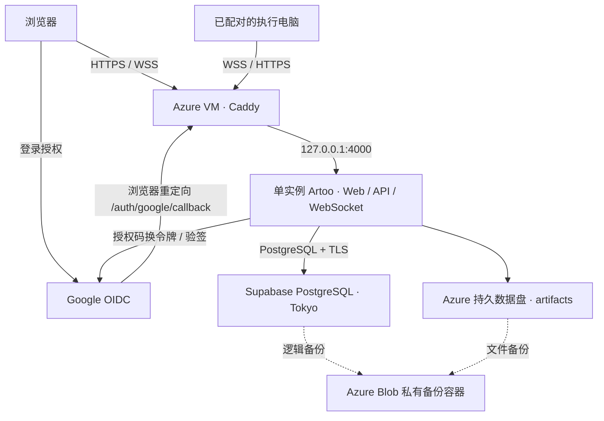

# Azure + Supabase Web 部署操作方案

更新时间：2026-10-01。适用范围：一个可信团队、一个 Artoo 服务实例。

本方案采用 **Azure Linux VM 托管 Web/API，Supabase 托管 PostgreSQL，Google 直接登录**。
以后可将 PostgreSQL 数据迁到 Azure Database for PostgreSQL Flexible Server，保持应用域名和 Google 登录配置。

**交付状态：这是资源准备和后续接入方案，尚未部署服务。** 仓库已有 Google OIDC、同源 Web/API/WebSocket、Caddy 和 systemd 模板；生产入口目前仍直接使用 PGlite。下文标为“待实现”的 PostgreSQL 配置和命令，必须在[接入计划](superpowers/plans/2026-10-01-azure-supabase-web.md)完成后才能使用。仅创建 Supabase 项目或填写连接串不会切换当前数据库。

## 1. 下次从这里开始

按顺序完成以下事项，不需要先创建所有可选资源：

- [ ] 确认要复用的 Azure VM、SSH 登录方式、是否承载其他服务，以及最终子域名。
- [ ] 按第 3 节准备 VM、固定公网 IP、80/443 入站、持久磁盘和 DNS。
- [ ] 按第 4 节创建独立的 Supabase 项目，保存连接信息和数据库 CA。
- [ ] 按第 5 节创建 Google Web OAuth Client，登记真实回调地址和团队邮箱。
- [ ] 完成接入计划中的 PostgreSQL 适配、迁移权限、单实例保护和登录/路由修正。
- [ ] 按第 6 节安装服务并执行第 7 节验收；验收通过后再让团队日常使用。

本次只读资源盘点发现：当前订阅中有 Japan East 的 Ubuntu 24.04 VM，规格为 `Standard_D2as_v7`，状态为 `deallocated`，没有独立数据盘，网卡有多个公网 IP 配置。它可以作为候选，但需要先确认用途、端口和实际出网 IP；没有在本次操作中启动或修改它。资源状态会变化，执行时重新检查。

将下列值保存在自己的部署记录中。这里不填写真实密钥、订阅 ID 或公网地址：

| 参数 | 用途 / 示例 |
| --- | --- |
| 完整域名 | `artoo.example.com`；全文的示例域名都替换成它 |
| VM / Resource Group / 地区 | 优先复用现有 Linux VM；当前候选位于 Japan East |
| 入站公网 IP | DNS A 记录指向的、绑定该 VM 的固定 IPv4 |
| 实际出网 IP | Supabase Network Restrictions 放行的地址；多网卡/NAT 时可能与入站不同 |
| 管理公网 IP | NSG SSH 规则允许的管理员地址 `/32` |
| Supabase Project Ref / PG 主版本 | 连接池用户名、迁移工具和未来目标版本选择 |
| Google Client ID / Client Secret | 通过本地受限文件或密钥管理器交付，不写进 PR、聊天或命令行参数 |
| Owner / 允许登录邮箱 | Owner 必须属于允许登录的邮箱集合 |

## 2. 部署结构与范围



Web、`/auth/*`、`/api/v1/*`、控制端及执行节点的 WebSocket 使用同一域名。Supabase 只提供标准 PostgreSQL，不使用 Supabase Auth、浏览器直连数据库、Realtime 或 Storage API。附件暂存 Azure 磁盘；Blob 在此方案中用于备份，现有产品尚无线上附件 Blob 适配。

初版保持一个服务进程。数据库移到云端后，节点连接、调度和恢复状态仍有进程内部分，不能直接开启多副本或让新旧版本同时运行。执行模型任务还需要已配对的执行电脑及其模型 CLI/提供方配置；Web 服务器上线不等于已有可执行模型的 worker。

## 3. Azure 资源创建与配置

### 3.1 资源清单

| 资源 | 配置建议 | 是否需要新建 |
| --- | --- | --- |
| Resource Group | 复用 VM 所属组；全新部署可用 `rg-artoo-prod` | 有现成组就复用 |
| Linux VM | Ubuntu 24.04 LTS x64；现有机器优先；新建参考 `Standard_D2as_v5`（2 vCPU / 8 GiB） | 无合适 VM 才新建 |
| OS disk | 新建时 64 GiB Standard SSD 起步；代码放 `/opt/artoo` | 现有足够就复用 |
| Data disk | Standard SSD，64–128 GiB 起步，挂载 `/var/lib/artoo` | 当前候选 VM 需要准备 |
| Public IP | Standard / IPv4 / Static，绑定 VM 网卡 | 固定 IP 可复用 |
| VNet / Subnet / NSG | 复用兼容网络；新增规则见下表 | 通常复用 |
| DNS | 子域名 A 记录指向选定公网 IPv4，初始 TTL 300 | 在现有域名服务商创建 |
| Storage Account | Standard GPv2 / LRS；私有容器 `artoo-backups` | 建议用于异地于 VM 的备份 |
| Managed Identity | VM 开启 System assigned identity；给备份容器范围的 `Storage Blob Data Contributor` | 使用 Blob 备份时配置 |
| Monitor | VM 可用性、CPU、磁盘剩余空间和备份失败告警 | 上线时配置 |

具体价格和 SKU 配额以所选订阅、区域的 Azure Portal 为准。VM、磁盘、公网 IP、备份存储会分别计费；停止分配 VM 也不代表磁盘和公网 IP 免费。

### 3.2 Portal 操作顺序

1. 打开 **Virtual machines → 目标 VM**，确认 Linux、规格、地区和现有用途。新建时选择 SSH public key 登录。复用机器先保留原有服务配置。
2. 在 **Networking / Network settings → Network interface → IP configurations** 确认用于 Artoo 的公网 IP，并在对应 Public IP 资源中确认 Standard 和 Static。优先使用 primary IP configuration 对应的可达公网 IP。若使用 secondary，先以 `ip -4 addr` 确认关联私网 IP 已配置到 Ubuntu，并按 Azure 文档持久配置、验证外网可达后再改 DNS；不要凭公网 IP 列表顺序选地址。
3. 在有效的网卡/子网 NSG 中添加下表规则，检查已有更高优先级规则是否影响结果。不要用一份新规则表覆盖原有 VPN 或其他业务规则。
4. 在 **Disks → Create and attach a new disk** 添加数据盘，建议单独命名 `artoo-data`。连接 VM 后按 Azure Linux 数据盘文档识别新盘、创建文件系统并按 UUID 挂载到 `/var/lib/artoo`。**只能格式化确认空白的新盘**；有数据的盘需先备份和迁移。
5. 在 DNS 服务商创建 A 记录；初次上线采用 DNS only，先跑通 Caddy 证书和 WebSocket。不要为未配置的 IPv6 地址创建 AAAA。已有 CDN 代理可在基础验收后单独验证。
6. 如使用 Blob 备份，创建私有 Storage Account/container，禁用匿名 Blob 访问和不安全 HTTP；给 VM 身份授予容器范围权限，并设置生命周期保留规则。首次建议保留 7 个日备份和 4 个周备份，按可接受数据损失量调整。
7. Monitor 中添加 VM 不可用和 CPU 告警。磁盘空间、内存属于来宾系统指标，需要 Azure Monitor Agent/数据收集规则或等效主机监控；平台 CPU 指标不能代替磁盘空间检查。

| 方向 | 端口 | 来源/目标 | 用途 |
| --- | --- | --- | --- |
| 入站 | TCP 443 | Internet → VM | Web、API、Google 回调、WSS |
| 入站 | TCP 80 | Internet → VM | HTTPS 跳转和证书签发 |
| 入站 | TCP 22 | 管理员公网 IP `/32` → VM | SSH；也可沿用已有安全管理通道 |
| 入站 | 4000 / 5432 / 6543 | 不新增公网放行 | Node 仅监听 loopback；远程数据库不需要 VM 数据库入站规则 |
| 出站 | TCP 443 | Google、软件仓库、证书服务、Blob | 登录、更新和备份 |
| 出站 | TCP 5432 | Supabase 实际数据库/Session pooler 主机 | PostgreSQL |

新建 Azure 网络必须有明确出网路径。单 VM 绑定 Standard 公网 IP 可提供出网；若现有网络有 NAT Gateway/防火墙，以它的实际出网地址为准。先测连接，再收紧 Supabase IP 白名单。

主机初检命令（只读）：

```bash
cat /etc/os-release
sudo ss -lntup
ip -4 addr
lsblk -o NAME,SIZE,FSTYPE,MOUNTPOINTS,MODEL
findmnt /var/lib/artoo
df -h
node --version
npm --version
```

确认 80/443 没被另一项服务占用；如果已有反向代理，复用它的虚拟主机能力，不再启动一个抢占同端口的 Caddy。

## 4. Supabase：先创建数据库，再接入代码

### 4.1 创建项目

1. 在 Supabase Dashboard 创建**独立项目**，例如 `artoo-prod`，避免与其他应用共用业务表。
2. 当前 Azure Japan East 候选对应 Supabase **Northeast Asia (Tokyo)，`ap-northeast-1`**。如果最终选了其他 VM 区域，选择靠近它的 Supabase 区域。
3. 生成强数据库密码并放进密码管理器。记录 PostgreSQL 主版本；导出工具不能旧于源服务器，后续 Azure 目标应选择相同或兼容的较新主版本并先试恢复。
4. 个人试用可以先用 Free。Free 低活跃项目可能在约 7 天后暂停，且不能把付费项目的自动备份能力当作 Free 已提供；稳定多人使用建议付费，并仍保留自己的可恢复备份。

### 4.2 关闭不使用的数据接口

在项目的 **Data API 设置**关闭 **Enable Data API**。本应用只通过服务器访问 PostgreSQL，认证与团队准入由 Artoo 处理。网络 IP 限制只保护数据库/连接池，不保护 Supabase 的 HTTPS 数据 API，因此不能用网络白名单替代关闭 Data API。

接入时采用专用 `artoo_migrator` 和 `artoo_app` 数据库角色：前者只在发布迁移时使用，后者用于日常读写。业务对象保留在 `public`，迁移日志在 `artoo_meta`；不给浏览器数据库密码、`anon`/publishable key 或 service-role key。

角色初始化应完成以下授权，并验证 `anon`/`authenticated` 对应用对象没有现有或默认访问权限：

- `artoo_migrator` 拥有应用表和迁移日志，能在上述 schema 内执行 DDL；不授予 superuser、创建数据库或创建角色能力。
- `artoo_app` 对业务表拥有 SELECT/INSERT/UPDATE/DELETE，对序列拥有必要 USAGE，对迁移日志只读；无 DDL 权限。
- 迁移角色新建表/序列的默认权限同时覆盖运行角色授权和 API 角色撤权。恢复备份后重新核对授权。

这些角色和初始化 SQL由[接入计划](superpowers/plans/2026-10-01-azure-supabase-web.md)交付；创建项目时不需要手动建业务表。历史迁移含显式 `public` 引用和校验和，不能仅设置 `search_path=artoo`，也不能改写旧 SQL 来迁 schema。

### 4.3 连接方式与 TLS

打开 Dashboard **Connect**，复制当前项目给出的 host、port、database 和用户名格式；不要根据区域猜 pooler 主机名。

| 方式 | 使用条件 | 本方案选择 |
| --- | --- | --- |
| Direct，通常 5432 | 默认通常需要 IPv6；IPv4 需支持的 add-on | VM 有可靠 IPv6/IPv4 direct 能力时优先用于迁移、导出和恢复 |
| Shared pooler / **Session mode，5432** | 支持 IPv4，服务端连接生命周期稳定 | IPv4 VM 的常驻 Node 服务默认选择 |
| Transaction mode，6543 | 连接按事务复用 | 本方案不使用：不能承载服务生命周期的 session advisory lock |

自定义角色的 pooler 用户名按 Supabase 规则包含项目标识；将 Connect 示例中的管理员角色换为实际创建的应用角色，并先验证连接。数据库 URL 中密码的特殊字符需要正确 URL 编码。

在 **Database Settings → SSL Configuration** 启用 SSL enforcement，并保存当前连接需要的 CA。应用驱动必须验证 CA 和主机名；运维工具使用 `verify-full`，不得通过关闭证书验证来消除连接错误。启用 SSL enforcement 可能导致数据库短暂重启，应在首次接入时完成。

在 **Database Settings → Network Restrictions** 放行 VM 的实际固定出网地址 `/32`；运维连接需要时加入自己的固定管理地址。走 IPv6 direct 时加入对应 IPv6 CIDR。修改限制通常替换已有集合，保留仍需使用的地址。

从 VM 验证 `SELECT version()` 和数据库 TLS；迁移、备份、恢复也要实际跑通。官方优先推荐 direct 做迁移/备份；如果选择 Session pooler，先完成完整迁移与 dump/restore 验收，不把应用查询成功当成运维流程已验证。

## 5. Google 登录直接接入

代码已有 `GET /auth/google/start`、Google 授权码 + PKCE 流程、`/auth/google/callback`、安全会话 cookie、退出和团队准入。Google 身份记录存入应用数据库；不启用 Supabase Auth，因此以后迁数据库不需要改 Google 登录架构。

### 5.1 Google Cloud Console

1. 创建/选择一个 Google Cloud Project，进入 **Google Auth Platform**。
2. **Branding**：应用名称、真实支持邮箱和开发者联系邮箱。需要授权域名时填写可注册根域，例如 `example.com`；正式品牌发布可能需要 Search Console 域名验证、公开首页和真实隐私政策。
3. **Audience**：个人 Gmail 或跨组织团队选择 **External**；仅同一 Workspace/Cloud Identity 组织内部才考虑 Internal。首次联调保持 Testing，并添加团队测试邮箱。
4. **Data Access**：只申请基本身份范围 `openid`、email、profile（Console 可能显示 `userinfo.email` / `userinfo.profile`）。不需要启用 Gmail/Drive API 或创建 service account。
5. **Clients → Create Client → Web application**，名称可用 `Artoo Web Production`。
6. **Authorized redirect URIs** 添加下面的地址，替换域名，**末尾没有 `/`**：

   ```text
   https://artoo.example.com/auth/google/callback
   ```

7. 此实现是服务器重定向流程，**Authorized JavaScript origins 可留空**；如果填写，仅填 `https://artoo.example.com`，不带路径。这里不登记 Supabase 的回调地址。
8. 将 Client ID / Secret 保存到服务器的受限环境文件。真实 Secret 不进入仓库、PR、聊天、浏览器构建变量或截图。
9. 团队正式使用前按 Console 提示处理 In production 和品牌发布。基本身份范围不涉及敏感/受限 scope 审核，不代表品牌展示永远免验证。

个人 Gmail 不设置 `GOOGLE_HOSTED_DOMAIN`。应用自己的 `AUTH_ALLOWED_EMAILS` 控制谁能进入团队，Google 测试用户列表不能替代它。浏览器要能访问 `accounts.google.com`，VM 要能访问 `oauth2.googleapis.com` 和 `www.googleapis.com`；部署在 Azure 不会自动解决使用者网络的 Google 可达性。

### 5.2 环境配置

部署时使用 `/etc/artoo/artoo.env`，属主 `root:artoo`，权限 `0640`，不要在 release 目录留下另一个 `.env`。现有配置项如下；示例邮箱和域名必须换成实际值：

```dotenv
GOOGLE_CLIENT_ID=your-web-client-id
GOOGLE_CLIENT_SECRET=your-web-client-secret
GOOGLE_REDIRECT_URI=https://artoo.example.com/auth/google/callback
AUTH_ALLOWED_EMAILS=owner@example.com,member@example.com
AUTH_OWNER_EMAILS=owner@example.com
ARTOO_PAIRING_PEPPER=your-stable-random-secret
ARTOO_DATA_DIR=/var/lib/artoo
ARTOO_HOST=127.0.0.1
ARTOO_PORT=4000
ARTOO_DESKTOP_CORS=1
ARTOO_DESKTOP_CORS_ORIGINS=null
ARTOO_CONTROL_TOKEN_TTL_MS=2592000000
```

`ARTOO_PAIRING_PEPPER` 首次生成后保存在密钥管理器，部署和数据库迁移时保持不变。可以用 `openssl rand -hex 32` 在自己的终端生成，直接写入受限配置。Owner 邮箱必须也在允许集合中。仅 Web 使用时可不启用 Desktop CORS；使用桌面客户端时保留上面精确的 `null` origin，不设通配符。

**接入计划待实现的配置**：`DATABASE_URL`（应用角色）、`DATABASE_SSL_CA_FILE`（需要的 CA 路径）。迁移进程另用 `MIGRATION_DATABASE_URL`，不把迁移角色密码放进长期运行的服务环境。当前版本不读取这些数据库变量；配置它们之前必须先完成 PostgreSQL 适配和“禁止静默回退 PGlite”的检查。

## 6. 主机安装与发布

以下步骤在 PostgreSQL 接入验收完成后执行：

1. 安装 Node.js **24+**、npm **11+**、Caddy 2、Git、与源数据库兼容的 PostgreSQL 客户端。采用官方安装文档；核对 `node --version`、`npm --version`、`caddy version` 和 `pg_dump --version`。
2. 建立无特权 `artoo` 系统用户/组。版本目录放在 `/opt/artoo/releases/<commit>`，`/opt/artoo/current` 指向当前版本；代码对服务用户可读，只有部署者可写。数据盘挂到 `/var/lib/artoo`，由 `artoo` 写入。
3. 取合并后的指定 release，在仓库根目录运行 `npm ci` 和 `npm run build:preview`。该构建会打开登录门禁并生成同源静态资源。
4. 放置环境文件和 CA。首次安装、还没有运行中的服务时，使用专用迁移环境执行待实现的 `npm run db:migrate`。升级时暂不运行迁移，按第 7 步先停旧服务。应用启动只验证迁移版本，不用应用角色执行 DDL。
5. 复用 [`deploy/artoo-preview.service`](../deploy/artoo-preview.service)。核对其中 `/usr/bin/node` 与实际 Node 24 路径一致。先在仓库根目录安装 unit，再编辑配置：

   ```bash
   sudo install -m 0644 deploy/artoo-preview.service /etc/systemd/system/artoo-preview.service
   sudo systemctl daemon-reload
   sudo systemctl edit artoo-preview
   ```

   独立数据盘模式在编辑器中增加挂载依赖：

   ```ini
   [Unit]
   RequiresMountsFor=/var/lib/artoo
   ```

   数据盘按 UUID 配置在 `/etc/fstab`；验收重启后仍正确挂载，服务不会在缺盘时向空目录写业务文件。

6. 复用 [`deploy/Caddyfile`](../deploy/Caddyfile)，把示例域名改成实际子域名。已有 Caddy 时并入现有配置，不覆盖其他站点；已有其他代理时配置等价的 HTTPS 和 WebSocket 转发。
7. 升级顺序固定为：先构建新 release → 维护窗口停旧服务 → 备份 → 从新 release 执行数据库迁移 → 切换 `current` → 启动并验收。迁移与运行服务互斥；首次安装也要在迁移成功后才启用服务。生产使用一个服务进程，禁止 PM2 cluster、多实例和新旧版本重叠发布。

安装/检查服务时可执行：

```bash
sudo systemd-analyze verify /etc/systemd/system/artoo-preview.service
sudo caddy validate --config /etc/caddy/Caddyfile
sudo systemctl daemon-reload
sudo systemctl enable --now artoo-preview
sudo systemctl reload caddy
sudo systemctl status artoo-preview --no-pager
```

不要把首次启动成功当成部署完成。Google client、Supabase 项目、最终域名尚未提供时，只能做本地/测试提供方验证。

## 7. 上线验收

- [ ] 公网 HTTPS 证书正确；首页、`/channels`、`/channels/` 直接打开/刷新都能加载脚本和样式。
- [ ] `/health/ready` 成功，日志确认实际使用 PostgreSQL；错误连接串、错误 CA 或无数据库权限时启动失败，不能悄悄创建本地 PGlite。
- [ ] 用真实 Google 允许账号登录，首次 Owner/Member 角色正确；非允许账号被拒绝；刷新保留会话，退出后受保护 API 返回 401。
- [ ] 两个独立客户端互发消息并即时同步；注销/撤销设备后相应 WebSocket 失效；断网重连能补齐消息。
- [ ] 已配对执行电脑连接成功；实际完成一次任务/产物上传，浏览器能下载和审核。
- [ ] 服务重启、VM 重启后，挂载、身份、历史和产物保持；第二个服务实例被拒绝，不干扰运行中的节点。
- [ ] 真实 PostgreSQL 上并发操作和消息游标没有漏事件，重复请求不生成重复写入。
- [ ] 从独立备份恢复到一个新的数据库和文件目录，验证登录、历史、精确产物字节以及执行节点重连。

验收记录保留 release commit、PG 版本、日期和结果，截图/日志移除 cookie、授权码、连接串和密钥。仓库已有 32 项核心认证测试在 2026-10-01 本地通过，使用 fake OIDC + PGlite；它们不是这份公网验收的替代品。

## 8. 备份、升级与迁移 Azure PostgreSQL

### 8.1 备份

当前 `npm run storage -- backup ...` 针对 PGlite，不能用于 Supabase。远程 PostgreSQL 使用 `pg_dump`/`pg_restore`，附件另行备份。先等待执行任务结束，在维护窗口停写/停止服务，再制作同一批数据库与文件快照。

数据库导出仅包含应用 `public` 和 `artoo_meta`，保留数据、序列状态和迁移校验记录，不导出 Supabase 的 `auth`、`storage`、`realtime` 等平台 schema。连接参数放在权限 `0600` 的 PostgreSQL service/password 文件中，避免密码出现在进程参数和 shell 历史：

```bash
# 在 pg_service.conf 中定义 artoo-source，并配置 verify-full 和正确 CA。
# PGSERVICEFILE / PGPASSFILE 指向受限文件。
# /var/backups/artoo 由备份用户预先建立，属主为该用户，权限 0700。
(
  set -eu
  umask 077
  backup_dir=$(mktemp -d /var/backups/artoo/backup-XXXXXXXX)
  cd "$backup_dir"
  PGSERVICE=artoo-source pg_dump \
    --format=custom --schema=public --schema=artoo_meta \
    --no-owner --no-acl --file=database.dump
  tar -C /var/lib/artoo -czf artifacts.tar.gz artifacts
  sha256sum database.dump artifacts.tar.gz > SHA256SUMS
  printf 'Backup directory: %s\n' "$backup_dir"
)
```

备份角色需具备 `public` / `artoo_meta` 的 USAGE、所有应用表的 SELECT 和所有应用序列的 SELECT；仅有序列 USAGE 不足以导出序列状态。新增对象的默认授权也要覆盖这些权限。把以上文件、release commit、PG 版本和时间上传私有 Blob；密钥和恢复凭据单独管理。先检查这些命令成功再恢复服务，失败保留现场并告警。Blob 生命周期/删除权限和备份脚本由后续接入工作配置，现有仓库没有完成的 Azure Blob 备份定时任务。

### 8.2 迁到 Azure Database for PostgreSQL Flexible Server

1. 创建与 VM 同区域的 Flexible Server，选择已通过恢复测试的 PG 主版本。选择 VM 可达的私有网络，或严格放行实际出网 IP 的公网访问；使用 Azure 提供的 CA/主机名验证。
2. 创建专用空数据库和迁移/应用角色。恢复准备与首次初始化分开：先只创建数据库/角色，由管理员使 `artoo_migrator` 拥有这个目标数据库及默认 `public` schema，以该角色恢复，再补齐应用权限。仅有 CREATE 权限不足以清理已存在的 schema。不要先执行会创建 `artoo_meta` 和业务表的完整 bootstrap/迁移，否则会与归档中的建表语句冲突。不迁移 Supabase 平台角色。
3. 先用一份备份恢复演练，验证 schema、行数、序列、迁移日志和认证，再安排正式切换窗口。
4. 等任务结束，停止 Artoo 写入，制作最后一次数据库及附件备份，并保持源库停写。
5. 用 `pg_restore --list database.dump` 核对归档，重新确认 `artoo-target` 指向专用新空目标。下面命令含清理动作，目标存在业务数据时必须中止；恢复身份须能删除/重建归档内 schema。PostgreSQL service 文件中定义正确的目标和 TLS 后执行：

   ```bash
   pg_restore --dbname='service=artoo-target' \
     --clean --if-exists --single-transaction \
     --no-owner --no-acl --exit-on-error database.dump
   ```

6. 补齐目标角色授权，核对迁移历史。更新 `DATABASE_URL`、CA 和独立迁移连接配置。保持域名、Google Client、回调、用户标识和 `ARTOO_PAIRING_PEPPER` 不变。VM 未换时附件仍用原挂载路径。
7. 启动单实例并完成第 7 节验收。验收完成前不删除 Supabase 源项目；进入正式写入前准备好失败回退步骤。

目标已经产生新写入后，不能直接切回旧 Supabase 库而忽略新数据；必须再次停写、保留两边数据并做反向同步/恢复。普通版本回滚也不能把旧代码指向已升级的 schema，应恢复对应版本的数据库和附件备份。

## 9. 官方参考

以下页面在制定方案时核对；控制台入口名称和套餐能力以后可能变化，以执行时页面为准。

- [Azure VM 规格](https://learn.microsoft.com/en-us/azure/virtual-machines/sizes/general-purpose/dasv5-series)、[公网 IP](https://learn.microsoft.com/en-us/azure/virtual-network/ip-services/public-ip-addresses)、[明确出网](https://learn.microsoft.com/en-us/azure/virtual-network/ip-services/default-outbound-access)。
- [Azure NSG](https://learn.microsoft.com/en-us/azure/virtual-network/network-security-groups-overview)、[多个 IP 的主机配置](https://learn.microsoft.com/en-us/azure/virtual-network/ip-services/virtual-network-multiple-ip-addresses-portal)、[Linux 数据盘](https://learn.microsoft.com/en-us/azure/virtual-machines/linux/attach-disk-portal)、[VM 监控](https://learn.microsoft.com/en-us/azure/azure-monitor/vm/monitor-virtual-machine)、[Blob RBAC](https://learn.microsoft.com/en-us/azure/storage/blobs/authorize-access-azure-active-directory)。
- [Supabase 连接方式](https://supabase.com/docs/guides/database/connecting-to-postgres)、[地区](https://supabase.com/docs/guides/platform/regions)、[关闭 Data API / 权限](https://supabase.com/docs/guides/database/hardening-data-api)、[TLS](https://supabase.com/docs/guides/platform/ssl-enforcement)、[网络限制](https://supabase.com/docs/guides/platform/network-restrictions)、[生产准备](https://supabase.com/docs/guides/platform/going-into-prod)、[备份](https://supabase.com/docs/guides/platform/backups)。
- Google 官方：[Consent / Audience](https://developers.google.cn/workspace/guides/configure-oauth-consent?hl=en)、[Web Client](https://developers.google.cn/workspace/guides/create-credentials?hl=en)、[OIDC](https://developers.google.cn/identity/openid-connect/openid-connect?hl=en)、[品牌验证](https://developers.google.cn/identity/protocols/oauth2/production-readiness/brand-verification?hl=en)。
- [Node.js 安装](https://nodejs.org/en/download)、[Caddy 安装](https://caddyserver.com/docs/install)、[PostgreSQL 连接 service 文件](https://www.postgresql.org/docs/current/libpq-pgservice.html)。
