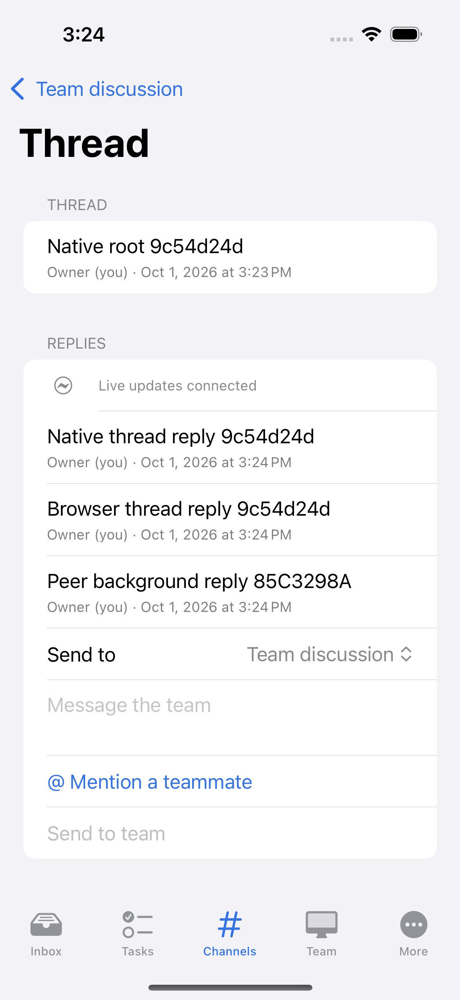
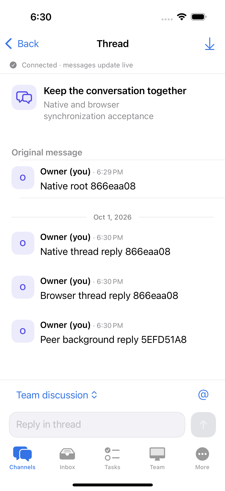

# Native collaboration UI — first implementation milestone

The October 1, 2026 product direction makes conversation the primary entry point. The native app therefore opens Channels first while keeping Inbox, Tasks, Team, More, and their existing navigation destinations available.

## Reference patterns

| Product pattern | Native implementation |
| --- | --- |
| Slack: searchable channels and replies scoped to an original message | Channel directory with topic previews, separate creation sheet, named room title, explicit thread actions, original-message context |
| Discord: recognizable speaker identity and a readable conversation timeline | Consistent identity tiles, author-first messages, compact local times, date dividers, semantic mention treatment |
| Teams: conversation remains available while related work has a separate home | Fixed message composer; decisions, handoffs, blockers and recording tools in channel details; agent requests retain links to their execution tasks |
| Linear / Asana: scan work by state and make the next action clear | Counted status filters, concise task cards, unassigned state, contextual next-step guidance, clearer creation and assignment forms |

These are interaction references, not claims of feature parity. The client uses actual server channels, messages, notification counts, assignees, and statuses. It does not invent direct messages, read receipts, channel unread counts, presence, or reactions.

## Behavior retained

- Room/thread draft isolation, stable pending-send identifiers, realtime reconciliation, paging, and reply counts stay in the existing view models.
- Initial room history opens at the latest message. Incoming messages follow only while the previous latest row is visible; otherwise a counted jump action appears. Loading older history does not move the reader. Mention deep links initially center their historical target; later updates do not repeatedly move the reader back to it.
- Message delivery explanations and raw errors are scrollable. The fixed composer exposes a recovery action and bounds its input height for accessibility text sizes and landscape.
- Agent selection still shows runtime, computer, workspace and collision identity. A disabled/deleted explicit selection stays visibly unavailable and blocks fresh requests until the user reselects or deliberately chooses Auto. Inventory loading cannot silently turn a persisted manual draft into Auto. Pending delivery keeps its original request identity. Execution approvals, cancellation, retry, request summaries, original content disclosures and planning-discussion restrictions remain in place.
- All 87 pre-existing accessibility identifiers in the changed source files are retained. New navigation and message actions have additional identifiers.
- Semantic color pairs adapt to dark appearance. New interactive controls use 44 pt targets; text uses native scalable styles. Task metadata has vertical fallbacks when horizontal space is limited.

## Native before and after

Both images show the same real-server thread scenario after foreground catch-up. The updated screen separates the original message from replies, places the author before each message, and keeps the composer at the bottom. Fixture message IDs and timestamps differ between runs.

| Before | After |
| --- | --- |
|  |  |

The images are unmodified approved PNG attachments named `Native real-server thread after foreground catch-up`, from the baseline and candidate runs below.

## Native verification

[Candidate run 36904277780](https://github.com/Xiejiayun/artoo/actions/runs/36904277780/job/110510801324) completed successfully on October 1, 2026 UTC. The downloaded reports were checked against their raw xcresult case exports, independently of the green job status.

| Check | Result |
| --- | --- |
| Native build and unit tests | Xcode build passed; 146 XCTest unit tests passed |
| Core collaboration workflows | 7 / 7 UI cases passed; 22 approved screenshots |
| Direct agent conversation and recovery | 1 / 1 UI case passed; 7 approved screenshots |
| Historical mentions and draft isolation | 1 / 1 UI case passed; 9 approved screenshots |
| Execution correction and exact stop | 1 / 1 UI case passed; 15 approved screenshots |
| Full native gate | 18 / 18 checks passed; all 10 required UI cases passed, with no skipped, expected-failure or unknown cases |
| Evidence integrity | 53 distinct required PNGs had complete decoded pixel streams; parent and child reports passed; all resource and temporary-directory cleanup checks passed |
| Visual review | All 53 candidate screenshots reviewed, including enlarged originals for dense content and critical controls; no blocking overlap, clipping or unreadable-state issue found in this simulator scope |

The mentions case checks the initial historical target without scrolling before its later interaction checks. The planning case preserves the exact original instruction bytes and hash, expanded/collapsed state, human acceptance and resulting task dependencies. Its text helper aligns by measured visibility gaps, including the small remaining margin for text nearly as tall as the viewport. Readable text that fits must remain completely visible; text taller than the viewport must expose at least half the viewport. Disclosure buttons still require enabled and hittable controls before tapping.

| Evidence source | Baseline | Candidate |
| --- | --- | --- |
| Workflow | [36881187470](https://github.com/Xiejiayun/artoo/actions/runs/36881187470/job/110433849528) | [36904277780](https://github.com/Xiejiayun/artoo/actions/runs/36904277780/job/110510801324) |
| Actual checkout | `ef4a8fd40ea21f7f693a4df028de9e0d846dc249` | `6be7b8dc6d47ba3f4f1921ca6f176388486f4724` |
| Branch | `main` | `user/jiaxie/ui-final-verification-20261002` |
| Native UI environment | Xcode 16.4 / 16F6; iPhone 16; iOS 18.5; Release | Xcode 16.4 / 16F6; iPhone 16; iOS 18.5; Release |
| Source stability | Stable throughout all suites | Stable throughout all suites |

Both runner reports recorded `working_tree_dirty: true`, tracked diff SHA-256 `61717b07761f860b4d2e2d918a2d13b4d502100b6ccf1d10e611bb95c2c8c377`, zero untracked source files, and empty untracked-source SHA-256 `e3b0c44298fc1c149afbf4c8996fb92427ae41e4649b934ca495991b7852b855`. They are stable recorded inputs, not clean-checkout claims. The candidate workflow head and actual checkout were both `6be7b8d`.

The native app sources and unit tests are byte-identical between `2dd1bed` and verified `6be7b8d`; only the core UI test disclosure and scrolling helpers changed. This documentation and its images follow the verified source commit. They do not imply a new native run or an identical whole-repository source fingerprint.

## Additional checks on Windows

- Static native API contracts passed: 22 request specimens, 51 server routes, and the existing realtime, scoped draft, stable-send, Keychain and icon checks.
- Native UI-suite contract and evidence-isolation tests passed: 45 tests. These checks validate suite selection and evidence requirements; the Apple run above provides actual native execution.
- The changed Swift source files and modified core/mentions UI tests parsed with the existing tree-sitter Swift grammar. This is syntax checking; native compilation and XCTest results are recorded separately above.
- `git diff --check` passed.

The UI test geometry helpers now exclude the fixed composer and connection strip from historical-message screenshot bounds. The mentions suite checks the composer against usable screen bounds, still excluding navigation, tabs and the read-error inset. Full-frame visibility, exact body/author/mention values, keyboard dismissal, real-server identity, delivery, approvals, and outcome assertions remain intact.

The screenshots cover the standard light appearance and default text size on the selected iPhone simulator. Physical devices, VoiceOver, dark appearance, the largest Dynamic Type sizes, smaller phones and iPad layouts remain separate manual acceptance work. Native keyboard dismissal, real-server delivery, background catch-up, historical-mention recovery, approvals and execution outcomes are exercised by the passing cases above.
