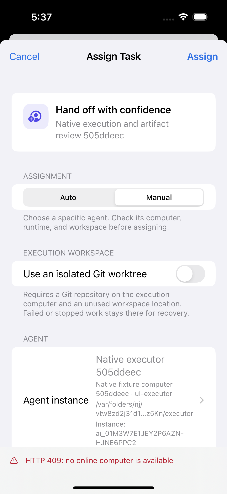
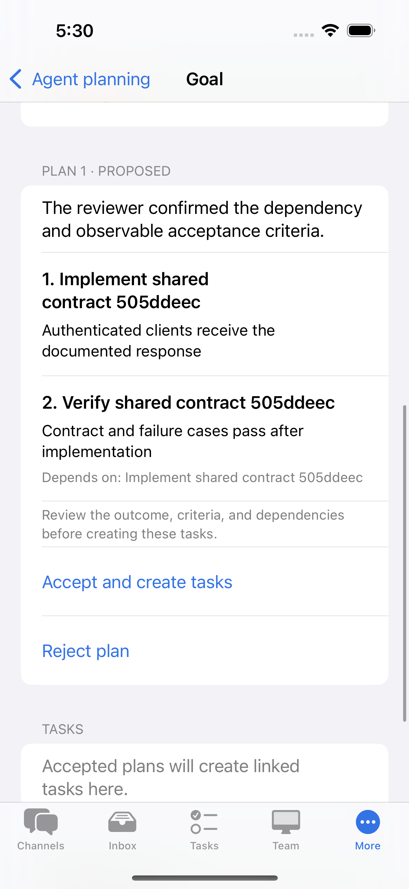

# Native work management UI — second implementation milestone

This pass builds on the conversation-first native UI. It addresses remaining navigation, information hierarchy, and long-content problems without adding server features.

## Changes and their purpose

- **Goals and plans:** the outcome, success criteria, planning, linked tasks, checkpoints, goal controls, and audit export have distinct sections. The goal title is readable content instead of an uppercase section header. Pause, resume, reconcile, and confirmed cancellation remain above long plans and task histories, with their existing API behavior. Plan proposals number their tasks; the first task no longer displays a dependency toggle that cannot affect its request.
- **Agent planning:** participants are numbered and separate from discussion limits. Agent selection shows name, computer, runtime, workspace, and a complete instance identity when rendered details collide. Duplicate selections have an explanation. A disabled or removed selection remains explicit and blocks a new request; a pending start still retries its original body and idempotency key.
- **Memory and skills:** memory detail shows the content once, with guidance for its actual review state. Replacement copy now describes the server's real behavior: the replacement becomes accepted immediately and the old memory becomes superseded. Skills show readable groups for files, network destinations, secret references, services, high-risk actions, and approval requirements. Raw permission JSON and manifest source remain available in disclosures. Manifest input disables automatic capitalization and correction.
- **Run history:** rows lead with the task, execution status, sequence/title, local date, and failure context. Search supports task names, statuses, and exact run IDs. Empty and no-match states explain the next step. Complete run identities remain available in the summary.
- **Team and setup:** agent rows expose computer/runtime context and collision identity. Workspace path fields support multiple lines. An empty runtime inventory explains how to populate it. Pairing fields keep visible labels after entry, and the one-time code uses the system code content type. Next advances through the server and device name fields; Done dismisses the keyboard while Connect remains an explicit action. Short instructions lead into the form, with account-permission guidance below it.
- **Large text:** metadata switches from label/value columns to vertical rows at accessibility sizes. Status badges can wrap. Task badges and execution headings adapt instead of forcing a single horizontal line. Native grouped lists/forms keep their platform layout on phone and iPad.

## Retained contracts

All 68 pre-existing accessibility identifier declarations and all API route literals in the six edited source files remain present. The task's model-owned feedback, review history, artifact provenance, stop confirmation, and execution-workspace controls remain intact. Goal cancellation still requires the existing explicit alert. Pending discussion retries bypass fresh-selection validation only to resend their captured request unchanged. The discussion-agent UI test now reveals and selects the exact instance by its stable ID in the navigation picker. Request models, server routes, and networking implementations were not edited in this pass.

Approvals, artifact previews, devices, privacy, and workspace settings were audited. Their existing decision boundaries and navigation were retained; shared metadata and badge improvements benefit their existing content where applicable.

## Verification

- [CI run 36897315175](https://github.com/Xiejiayun/artoo/actions/runs/36897315175) passed the shared, macOS, and iOS jobs for branch head `bc553c97abb3b682c5bdc10e94e9c4c55ec7ba93`. The actual PR merge checkout was `a3a262c3b48592222d5afafc81867cab7a85efbe`.
- The iOS gate passed all 18 checks, including the Xcode build and **146 unit tests with zero failures**. The native UI suites ran in Release on an **iPhone 16 simulator, iOS 18.5, with Xcode 16.4 (16F6) and the iOS 18.5 SDK**.
- The complete native aggregate passed **10 of 10 exact UI cases**, with no failures, skips, expected failures, or unknown cases: Core 7, Assistant 1, Mentions 1, and Correction 1. An independent audit of the retained `xcresult-tests.json` and `xcresult-summary.json` exports also passed the repository's exact suite contract.
- All **53 required native screenshots** were present with unique expected captions and complete, decodable PNG streams: Core 22, Assistant 7, Mentions 9, and Correction 15. Visual review covered all retained frames and enlarged assignment, agent-selection, and plan-proposal originals. The assignment error preserves the selected executor; duplicate executor choices show their full instance identity; proposed plans expose acceptance criteria, dependencies, and the explicit acceptance action. Review history, failed attempts, original and corrected artifacts, and stop confirmation remain readable.
- The aggregate, all four parent fixture reports, and all four native child reports agree on the source fingerprint recorded after XcodeGen preparation. Every parent and native child reports `source_stable: true`; the recorded tracked-diff SHA-256 is `61717b07761f860b4d2e2d918a2d13b4d502100b6ccf1d10e611bb95c2c8c377`. The recorded working tree is dirty after generation, with zero untracked source files and complete source inventory. Every suite exited successfully and confirmed fixture-resource, temporary-directory, and owned-process-group cleanup; the mentions fixture also confirmed browser-process cleanup.
- Shared verification passed 21 checks, including 193 test files / 1,377 tests (11 files / 30 tests skipped), 16 product browser workflows, and 6 authentication workflows. Native static contracts passed 22 request specimens / 51 routes, and the native suite/evidence tests passed 45 tests. The source identifier/route preservation audit, Swift grammar parsing, and `git diff --check` also passed.

The retained aggregate is `ios/native-suites-2026-10-01T17-15-38-449Z.json` in the run's native report artifact, with separate parent/child reports and raw XCTest exports under its four attempt directories. It finished at `2026-10-01T18:09:42.594Z`. The unit-test result is recorded at `17:15:31.720Z` in the iOS job log.

Integration commit `45071640c07b2262e17e51c57f2ca3c0fc07cc3e` subsequently brought in geometry-aware XCTest disclosure helpers. Relative to the tested branch head, it changes only `apps/ios/UITests/SharedServerChatUITests.swift`; native application, Web, desktop, server, and fixture-script sources match. The run above verifies the earlier test inputs; the later helper revisions need their own CI result.

## Captured native UI

These are unmodified frames from the passing Core suite above.

| Assignment rejection preserves the selected executor | Proposed plan shows task dependencies and acceptance |
| --- | --- |
|  |  |

## Coverage limits

The native workflows use a real server and deterministic local agent subprocess fixtures. They verify simulator behavior, server state, retained evidence, retries, and cleanup; live model-provider behavior and physical-device execution are outside this evidence. Visual acceptance covers the captured iPhone 16 light-appearance states. Small phones, iPad, dark appearance, maximum Dynamic Type, VoiceOver, and physical-keyboard behavior still need dedicated review. The run also does not provide screenshots of every memory, skill, run-search, planning-selection, or pairing state changed by this milestone.
